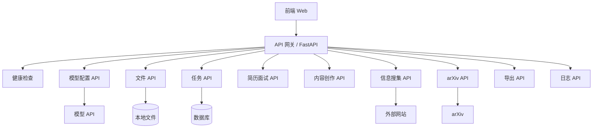
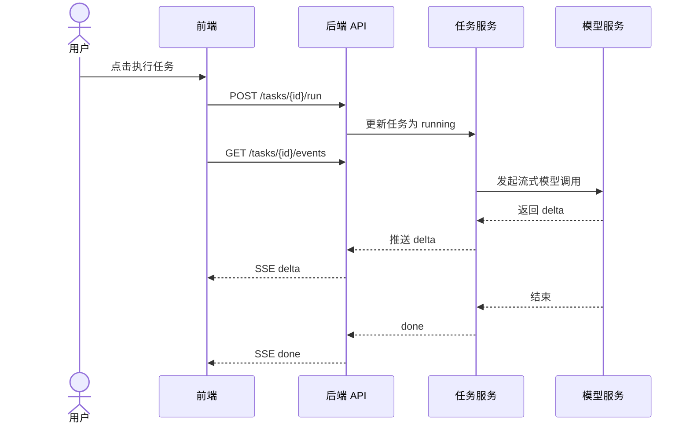
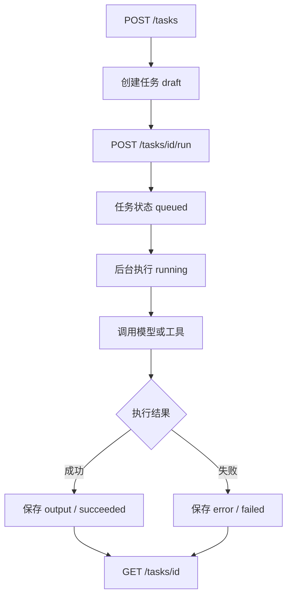
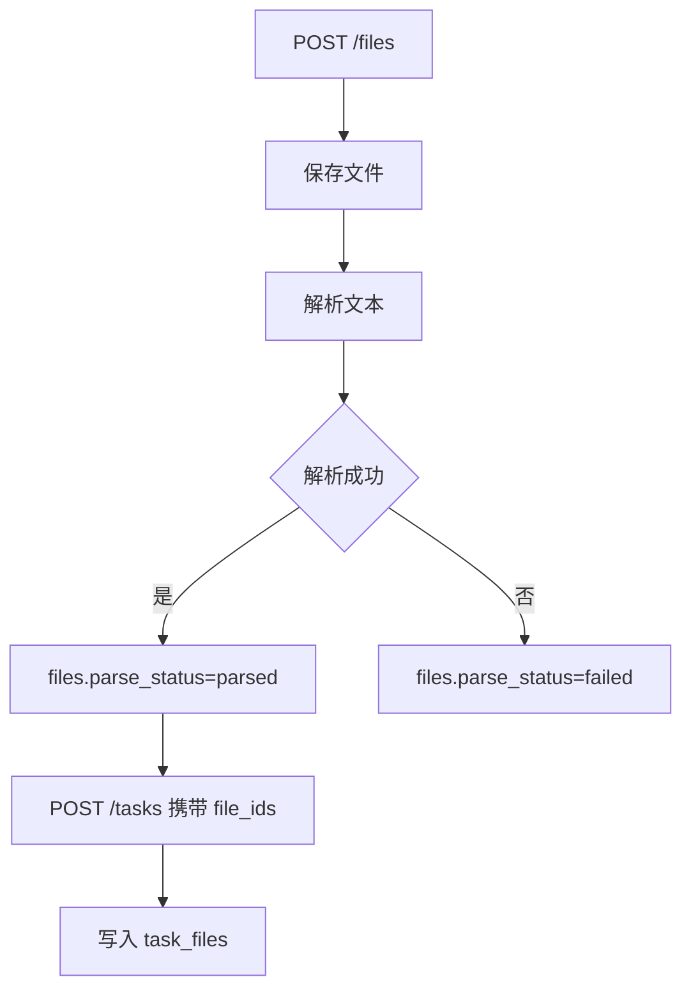
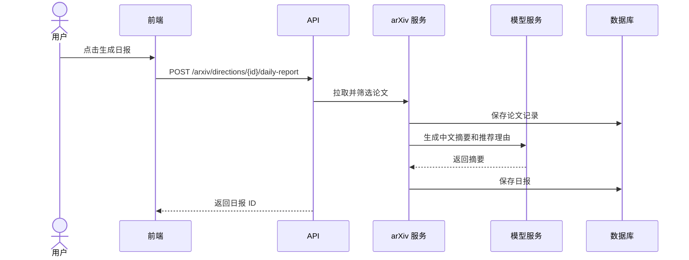

# 晨枢 AI - 产品类 - API 接口设计文档

## 清单

### 7 个步骤

- [x] 立项与产品定位
- [x] 需求分析
- [x] 原型与交互设计
- [x] 技术架构设计
- [x] 开发与工程化
- [x] 测试与上线准备
- [ ] 迭代与产品化

### 12 份文档

- [x] 项目立项文档
- [x] 产品定位与范围说明
- [x] PRD 产品需求文档
- [x] MVP 功能清单与优先级
- [x] 页面原型说明
- [x] 用户流程图 / 任务流程图
- [x] 技术架构设计文档
- [x] 数据库设计文档
- [x] API 接口设计文档
- [x] 开发规范文档
- [x] 部署运行文档
- [x] 测试用例与上线检查清单

---

## 1. 文档目的

本文档用于定义晨枢 AI MVP 阶段的 API 接口设计，包括接口分组、请求方法、路径、请求参数、响应结构、错误码、分页规范、任务状态流转、文件上传、模型配置、信息搜集、arXiv 日报和导出接口。

本文档面向前端开发、后端开发和后续测试用例编写。

## 2. API 设计原则

1. REST 风格优先。
   MVP 阶段以 REST API 为主，接口语义清晰，便于调试和测试。

2. 任务为中心。
   简历面试、内容创作、信息搜集、arXiv 日报等业务能力最终都落到任务创建、执行、状态查询和结果保存。

3. 响应结构统一。
   成功和失败响应使用统一格式，降低前端处理复杂度。

4. 异步任务可追踪。
   长耗时任务不要求立即返回最终结果，应返回任务 ID，前端通过轮询或 SSE 获取状态。

5. MVP 先简单，后续可扩展。
   首版支持单用户或弱登录；后续上线时再增强认证、权限、限流和审计。

## 3. 基础约定

### 3.1 Base URL

MVP 本地环境：

```text
http://localhost:8000/api/v1
```

后续部署环境：

```text
https://your-domain.com/api/v1
```

### 3.2 数据格式

默认请求与响应格式：

```text
Content-Type: application/json
```

文件上传接口使用：

```text
Content-Type: multipart/form-data
```

### 3.3 时间格式

统一使用 ISO 8601：

```text
2026-05-11T20:00:00+08:00
```

### 3.4 ID 格式

建议使用 UUID 字符串：

```text
550e8400-e29b-41d4-a716-446655440000
```

## 4. API 模块总览



## 5. 统一响应结构

### 5.1 成功响应

```json
{
  "success": true,
  "data": {},
  "message": "ok",
  "request_id": "req_20260511200000001"
}
```

### 5.2 失败响应

```json
{
  "success": false,
  "error": {
    "code": "MODEL_CONFIG_MISSING",
    "message": "当前没有可用模型配置",
    "details": {}
  },
  "request_id": "req_20260511200000001"
}
```

### 5.3 分页响应

```json
{
  "success": true,
  "data": {
    "items": [],
    "page": 1,
    "page_size": 20,
    "total": 100,
    "has_next": true
  },
  "message": "ok",
  "request_id": "req_20260511200000001"
}
```

## 6. 通用错误码

| 错误码 | HTTP 状态码 | 说明 |
| --- | --- | --- |
| `BAD_REQUEST` | 400 | 请求参数错误 |
| `UNAUTHORIZED` | 401 | 未登录或认证失败 |
| `FORBIDDEN` | 403 | 无权限 |
| `NOT_FOUND` | 404 | 资源不存在 |
| `VALIDATION_ERROR` | 422 | 字段校验失败 |
| `MODEL_CONFIG_MISSING` | 400 | 缺少模型配置 |
| `MODEL_CALL_FAILED` | 502 | 模型调用失败 |
| `FILE_TYPE_UNSUPPORTED` | 400 | 文件类型不支持 |
| `FILE_PARSE_FAILED` | 500 | 文件解析失败 |
| `TASK_NOT_EXECUTABLE` | 400 | 任务当前状态不可执行 |
| `CRAWL_FAILED` | 502 | 网页抓取失败 |
| `ARXIV_FETCH_FAILED` | 502 | arXiv 拉取失败 |
| `INTERNAL_ERROR` | 500 | 系统内部错误 |

## 7. 认证与用户接口

MVP 阶段可以采用单用户模式，认证接口可先弱化。若部署到私有服务器，建议保留简单登录。

### 7.1 获取当前用户

```text
GET /api/v1/me
```

响应示例：

```json
{
  "success": true,
  "data": {
    "id": "user_default",
    "display_name": "默认用户",
    "auth_type": "local"
  },
  "message": "ok",
  "request_id": "req_001"
}
```

## 8. 健康检查接口

### 8.1 服务健康检查

```text
GET /api/v1/health
```

响应示例：

```json
{
  "success": true,
  "data": {
    "status": "ok",
    "version": "0.1.0",
    "database": "ok",
    "storage": "ok"
  },
  "message": "ok",
  "request_id": "req_001"
}
```

## 9. 模型配置接口

### 9.1 获取模型配置列表

```text
GET /api/v1/models
```

查询参数：

| 参数 | 类型 | 必填 | 说明 |
| --- | --- | --- | --- |
| `enabled` | boolean | 否 | 是否只看启用配置 |

响应字段：

- `id`
- `provider`
- `base_url`
- `model_name`
- `display_name`
- `is_default`
- `is_enabled`
- `last_test_status`
- `created_at`

### 9.2 创建模型配置

```text
POST /api/v1/models
```

请求示例：

```json
{
  "provider": "openai_compatible",
  "base_url": "https://api.example.com/v1",
  "api_key": "sk-xxxx",
  "model_name": "gpt-4.1",
  "display_name": "默认写作模型",
  "is_default": true,
  "is_enabled": true
}
```

响应示例：

```json
{
  "success": true,
  "data": {
    "id": "model_001",
    "provider": "openai_compatible",
    "model_name": "gpt-4.1",
    "is_default": true
  },
  "message": "模型配置已创建",
  "request_id": "req_001"
}
```

### 9.3 更新模型配置

```text
PATCH /api/v1/models/{model_config_id}
```

### 9.4 删除模型配置

```text
DELETE /api/v1/models/{model_config_id}
```

### 9.5 测试模型连接

```text
POST /api/v1/models/{model_config_id}/test
```

响应示例：

```json
{
  "success": true,
  "data": {
    "status": "success",
    "latency_ms": 1200,
    "message": "连接成功"
  },
  "message": "ok",
  "request_id": "req_001"
}
```

## 10. 文件接口

### 10.1 上传文件

```text
POST /api/v1/files
```

请求类型：

```text
multipart/form-data
```

字段：

| 字段 | 类型 | 必填 | 说明 |
| --- | --- | --- | --- |
| `file` | file | 是 | 上传文件 |
| `usage_hint` | string | 否 | `resume`、`material`、`paper` |

响应示例：

```json
{
  "success": true,
  "data": {
    "id": "file_001",
    "original_name": "resume.pdf",
    "size_bytes": 204800,
    "parse_status": "parsing"
  },
  "message": "文件已上传",
  "request_id": "req_001"
}
```

### 10.2 获取文件列表

```text
GET /api/v1/files
```

查询参数：

| 参数 | 类型 | 必填 | 说明 |
| --- | --- | --- | --- |
| `page` | integer | 否 | 页码 |
| `page_size` | integer | 否 | 每页数量 |
| `parse_status` | string | 否 | 解析状态 |

### 10.3 获取文件详情

```text
GET /api/v1/files/{file_id}
```

响应字段：

- 文件元数据。
- 解析状态。
- 解析文本预览。
- 解析错误。

### 10.4 重新解析文件

```text
POST /api/v1/files/{file_id}/parse
```

### 10.5 删除文件

```text
DELETE /api/v1/files/{file_id}
```

## 11. 任务接口

### 11.1 创建任务

```text
POST /api/v1/tasks
```

请求示例：

```json
{
  "type": "content",
  "title": "公众号推文草稿",
  "description": "围绕 AI 工作台写一篇公众号文章",
  "model_config_id": "model_001",
  "input": {
    "content_type": "wechat_article",
    "topic": "个人 AI 工作台",
    "style": "清晰、专业、有启发",
    "length": "medium"
  },
  "file_ids": ["file_001"],
  "output_format": "markdown"
}
```

响应示例：

```json
{
  "success": true,
  "data": {
    "id": "task_001",
    "type": "content",
    "status": "draft",
    "title": "公众号推文草稿"
  },
  "message": "任务已创建",
  "request_id": "req_001"
}
```

### 11.2 获取任务列表

```text
GET /api/v1/tasks
```

查询参数：

| 参数 | 类型 | 必填 | 说明 |
| --- | --- | --- | --- |
| `page` | integer | 否 | 页码 |
| `page_size` | integer | 否 | 每页数量 |
| `type` | string | 否 | 任务类型 |
| `status` | string | 否 | 任务状态 |
| `keyword` | string | 否 | 搜索关键词 |

### 11.3 获取任务详情

```text
GET /api/v1/tasks/{task_id}
```

响应字段：

- 任务基础信息。
- 输入参数。
- 关联文件。
- 当前输出。
- 状态。
- 错误信息。
- 创建和更新时间。

### 11.4 更新任务

```text
PATCH /api/v1/tasks/{task_id}
```

适用场景：

- 修改标题。
- 修改输入。
- 修改描述。
- 保存编辑后的输出。

### 11.5 执行任务

```text
POST /api/v1/tasks/{task_id}/run
```

请求示例：

```json
{
  "stream": false,
  "force_rerun": false
}
```

响应示例：

```json
{
  "success": true,
  "data": {
    "task_id": "task_001",
    "status": "queued"
  },
  "message": "任务已提交执行",
  "request_id": "req_001"
}
```

### 11.6 重试任务

```text
POST /api/v1/tasks/{task_id}/retry
```

### 11.7 删除任务

```text
DELETE /api/v1/tasks/{task_id}
```

### 11.8 获取任务日志

```text
GET /api/v1/tasks/{task_id}/logs
```

### 11.9 保存任务结果版本

```text
POST /api/v1/tasks/{task_id}/versions
```

请求示例：

```json
{
  "title": "润色后版本",
  "content": "# 输出内容",
  "source": "edited"
}
```

### 11.10 获取任务结果版本

```text
GET /api/v1/tasks/{task_id}/versions
```

## 12. 任务流式输出接口

MVP 可先使用轮询。若实现流式输出，建议使用 SSE。

### 12.1 SSE 订阅任务输出

```text
GET /api/v1/tasks/{task_id}/events
```

事件类型：

| 事件 | 说明 |
| --- | --- |
| `status` | 任务状态变化 |
| `delta` | 模型增量输出 |
| `log` | 执行日志 |
| `error` | 错误信息 |
| `done` | 任务结束 |

SSE 示例：

```text
event: delta
data: {"text":"这里是增量输出"}

event: done
data: {"task_id":"task_001","status":"succeeded"}
```

### 12.2 流式调用链路



## 13. 简历与模拟面试接口

简历面试可作为任务接口的业务快捷封装，底层仍创建 `interview` 类型任务。

### 13.1 创建简历分析任务

```text
POST /api/v1/interview/analyze
```

请求示例：

```json
{
  "resume_file_id": "file_001",
  "job_description": "岗位 JD 文本",
  "model_config_id": "model_001"
}
```

响应：

```json
{
  "success": true,
  "data": {
    "task_id": "task_interview_001",
    "status": "queued"
  },
  "message": "简历分析任务已创建",
  "request_id": "req_001"
}
```

### 13.2 生成面试题

```text
POST /api/v1/interview/{task_id}/questions
```

请求示例：

```json
{
  "question_count": 8,
  "difficulty": "medium",
  "focus_areas": ["项目经历", "技术能力", "岗位匹配"]
}
```

### 13.3 提交面试回答

```text
POST /api/v1/interview/{task_id}/answers
```

请求示例：

```json
{
  "question_id": "q_001",
  "answer": "我的回答内容"
}
```

### 13.4 生成面试复盘

```text
POST /api/v1/interview/{task_id}/review
```

响应字段：

- 优势。
- 不足。
- 单题评价。
- 追问建议。
- 简历修改建议。
- 下一步准备计划。

## 14. 内容创作接口

内容创作也可通过通用任务创建完成。为了前端页面更简单，可以提供快捷接口。

### 14.1 生成内容大纲

```text
POST /api/v1/content/outline
```

请求示例：

```json
{
  "content_type": "novel",
  "topic": "未来城市中的 AI 助手",
  "style": "温暖、悬疑",
  "length": "medium",
  "materials": "补充素材",
  "file_ids": []
}
```

### 14.2 生成正文

```text
POST /api/v1/content/draft
```

请求示例：

```json
{
  "content_type": "wechat_article",
  "topic": "个人 AI 工作台",
  "outline": "已有大纲",
  "style": "专业、清晰",
  "model_config_id": "model_001"
}
```

### 14.3 改写内容

```text
POST /api/v1/content/rewrite
```

请求示例：

```json
{
  "source_content": "原文内容",
  "rewrite_type": "polish",
  "target_style": "更适合公众号",
  "model_config_id": "model_001"
}
```

改写类型：

- `polish`
- `expand`
- `shorten`
- `change_style`
- `platform_adapt`

## 15. 信息搜集接口

### 15.1 创建信息搜集任务

```text
POST /api/v1/research/tasks
```

请求示例：

```json
{
  "title": "AI Agent 产品信息汇总",
  "source_type": "url",
  "urls": [
    "https://example.com/article-1",
    "https://example.com/article-2"
  ],
  "keywords": [],
  "output_requirements": "汇总核心观点、产品差异和趋势",
  "model_config_id": "model_001"
}
```

响应：

```json
{
  "success": true,
  "data": {
    "task_id": "task_research_001",
    "status": "queued"
  },
  "message": "信息搜集任务已创建",
  "request_id": "req_001"
}
```

### 15.2 获取来源列表

```text
GET /api/v1/research/tasks/{task_id}/sources
```

### 15.3 重新抓取单个来源

```text
POST /api/v1/research/sources/{source_id}/refetch
```

### 15.4 生成汇总报告

```text
POST /api/v1/research/tasks/{task_id}/report
```

## 16. arXiv 接口

### 16.1 获取研究方向列表

```text
GET /api/v1/arxiv/directions
```

### 16.2 创建研究方向

```text
POST /api/v1/arxiv/directions
```

请求示例：

```json
{
  "name": "AI Agent 与多智能体",
  "keywords": ["agent", "multi-agent", "tool use"],
  "exclude_keywords": ["survey"],
  "categories": ["cs.AI", "cs.CL"],
  "is_enabled": true
}
```

### 16.3 更新研究方向

```text
PATCH /api/v1/arxiv/directions/{direction_id}
```

### 16.4 删除研究方向

```text
DELETE /api/v1/arxiv/directions/{direction_id}
```

### 16.5 手动拉取论文

```text
POST /api/v1/arxiv/directions/{direction_id}/fetch
```

响应：

```json
{
  "success": true,
  "data": {
    "direction_id": "dir_001",
    "fetched_count": 30,
    "new_count": 12
  },
  "message": "论文拉取完成",
  "request_id": "req_001"
}
```

### 16.6 获取论文列表

```text
GET /api/v1/arxiv/papers
```

查询参数：

| 参数 | 类型 | 必填 | 说明 |
| --- | --- | --- | --- |
| `direction_id` | string | 否 | 研究方向 |
| `date_from` | date | 否 | 开始日期 |
| `date_to` | date | 否 | 结束日期 |
| `starred` | boolean | 否 | 是否收藏 |

### 16.7 生成日报

```text
POST /api/v1/arxiv/directions/{direction_id}/daily-report
```

请求示例：

```json
{
  "report_date": "2026-05-11",
  "max_papers": 20,
  "model_config_id": "model_001"
}
```

### 16.8 获取日报列表

```text
GET /api/v1/arxiv/reports
```

### 16.9 获取日报详情

```text
GET /api/v1/arxiv/reports/{report_id}
```

## 17. 导出接口

### 17.1 导出任务结果

```text
POST /api/v1/export/tasks/{task_id}
```

请求示例：

```json
{
  "export_type": "markdown",
  "include_input": true,
  "include_sources": true
}
```

响应示例：

```json
{
  "success": true,
  "data": {
    "export_id": "export_001",
    "file_name": "公众号推文草稿.md",
    "download_url": "/api/v1/export/export_001/download"
  },
  "message": "导出成功",
  "request_id": "req_001"
}
```

### 17.2 下载导出文件

```text
GET /api/v1/export/{export_id}/download
```

## 18. 日志接口

### 18.1 获取模型调用日志

```text
GET /api/v1/logs/model-calls
```

查询参数：

- `task_id`
- `model_name`
- `status`
- `date_from`
- `date_to`

### 18.2 获取任务执行日志

```text
GET /api/v1/logs/tasks/{task_id}
```

## 19. 工作台汇总接口

工作台首页需要聚合最近任务、模型状态和今日报告。

### 19.1 获取工作台概览

```text
GET /api/v1/dashboard/summary
```

响应示例：

```json
{
  "success": true,
  "data": {
    "model_status": {
      "has_default_model": true,
      "default_model_name": "gpt-4.1",
      "last_test_status": "success"
    },
    "recent_tasks": [],
    "today_reports": [],
    "stats": {
      "task_count": 24,
      "running_count": 1,
      "failed_count": 2
    }
  },
  "message": "ok",
  "request_id": "req_001"
}
```

## 20. 核心业务调用链路

### 20.1 通用任务执行



### 20.2 文件上传与任务引用



### 20.3 arXiv 日报生成



## 21. 前端页面与 API 对照

| 页面 | 主要接口 |
| --- | --- |
| 工作台首页 | `GET /dashboard/summary` |
| 模型设置页 | `GET /models`、`POST /models`、`POST /models/{id}/test` |
| 文件管理页 | `GET /files`、`POST /files`、`GET /files/{id}` |
| 任务创建页 | `POST /tasks`、`GET /files`、`GET /models` |
| 任务详情页 | `GET /tasks/{id}`、`POST /tasks/{id}/run`、`GET /tasks/{id}/logs` |
| 简历面试页 | `POST /interview/analyze`、`POST /interview/{id}/questions` |
| 内容创作页 | `POST /content/outline`、`POST /content/draft`、`POST /content/rewrite` |
| 信息搜集页 | `POST /research/tasks`、`GET /research/tasks/{id}/sources` |
| arXiv 日报页 | `GET /arxiv/directions`、`POST /arxiv/directions/{id}/daily-report` |
| 历史任务页 | `GET /tasks` |

## 22. 接口安全设计

### 22.1 MVP 阶段

- 本地运行可使用默认单用户。
- 私有服务器建议启用简单登录。
- 文件上传限制类型和大小。
- API Key 不返回明文。
- 删除操作使用 `DELETE` 并前端二次确认。

### 22.2 后续上线阶段

- 增加 JWT 或 Session 认证。
- 增加用户级数据隔离。
- 增加接口限流。
- 增加操作审计。
- 增加 CORS 白名单。
- 增加 CSRF 防护。

## 23. 接口版本策略

当前版本：

```text
/api/v1
```

后续如出现不兼容变更，新增：

```text
/api/v2
```

版本策略：

- 兼容字段可以直接新增。
- 删除字段或修改语义需要新版本。
- 错误码应保持稳定。

## 24. MVP 接口验收标准

MVP 阶段 API 需要满足：

1. 可以创建、查询、执行、重试和删除任务。
2. 可以上传、解析、查询和删除文件。
3. 可以创建、更新、测试和删除模型配置。
4. 可以完成简历分析和模拟面试流程。
5. 可以完成内容大纲、正文和改写生成。
6. 可以创建信息搜集任务并查看来源。
7. 可以配置 arXiv 方向、拉取论文、生成日报。
8. 可以导出任务结果为 Markdown。
9. 长耗时任务有状态查询或 SSE 事件接口。
10. 所有失败响应使用统一错误结构。

## 25. 后续文档衔接

本 API 接口设计文档完成后，建议继续编写：

1. 《开发规范文档》。
2. 《部署运行文档》。
3. 《测试用例与上线检查清单》。
