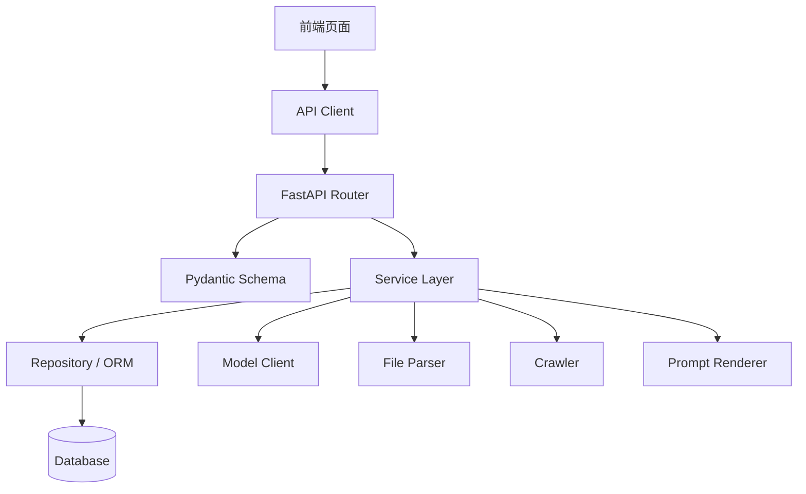
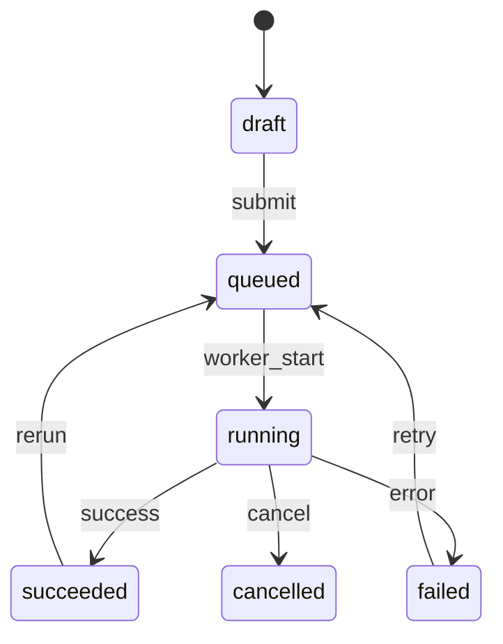
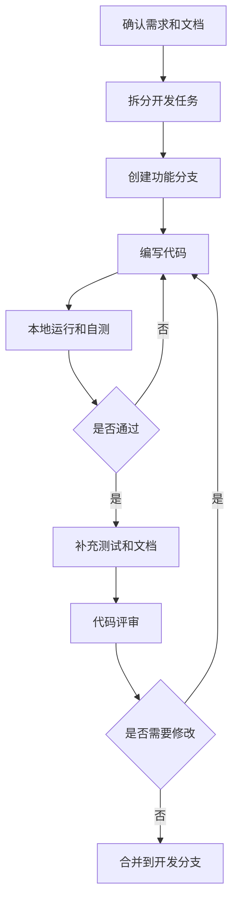

# 晨枢 AI - 产品类 - 开发规范文档

## 清单

### 7 个步骤

- [x] 立项与产品定位
- [x] 需求分析
- [x] 原型与交互设计
- [x] 技术架构设计
- [x] 开发与工程化
- [x] 测试与上线准备
- [ ] 迭代与产品化

### 12 份文档

- [x] 项目立项文档
- [x] 产品定位与范围说明
- [x] PRD 产品需求文档
- [x] MVP 功能清单与优先级
- [x] 页面原型说明
- [x] 用户流程图 / 任务流程图
- [x] 技术架构设计文档
- [x] 数据库设计文档
- [x] API 接口设计文档
- [x] 开发规范文档
- [x] 部署运行文档
- [x] 测试用例与上线检查清单

---

## 1. 文档目的

本文档用于规范晨枢 AI MVP 阶段及后续演进阶段的开发方式，包括项目结构、命名规范、前端规范、后端规范、API 规范、数据库规范、Prompt 规范、日志规范、错误处理、安全规范、Git 流程和测试要求。

目标是让项目从个人自用阶段开始就保持可维护、可扩展、可迁移，避免后续上线或接入本地模型时被早期随意实现拖住。

## 2. 适用范围

本文档适用于以下开发内容：

- 前端 Web 应用。
- 后端 API 服务。
- 数据库模型与迁移。
- 文件上传与解析。
- 模型调用与 Prompt 模板。
- 信息搜集与 arXiv 服务。
- 导出、日志、任务执行。
- 后续本地模型、RAG、定时任务扩展。

## 3. 技术栈约定

MVP 推荐技术栈：

| 层级 | 技术 |
| --- | --- |
| 前端 | Next.js / React / TypeScript |
| 后端 | Python / FastAPI / Pydantic |
| 数据库 | SQLite，后续 PostgreSQL |
| ORM | SQLAlchemy 或 SQLModel |
| 迁移 | Alembic |
| 文件存储 | 本地文件系统 |
| 异步任务 | FastAPI BackgroundTasks / APScheduler，后续 Celery + Redis |
| 模型接口 | OpenAI 兼容接口 |
| 文档解析 | pypdf、python-docx、Markdown/TXT 解析 |
| 网页抓取 | Requests、BeautifulSoup、Playwright |

## 4. 工程结构规范

建议采用前后端分离结构：

```text
chenshu-ai/
  apps/
    web/
      app/
      components/
      features/
      lib/
      styles/
      types/
    api/
      app/
        main.py
        api/
        core/
        db/
        models/
        schemas/
        services/
        workers/
        prompts/
        utils/
        tests/
  data/
    uploads/
    exports/
    sqlite/
  docs/
  scripts/
  .env.example
  docker-compose.yml
  README.md
```

目录职责：

- `apps/web/app`：页面路由。
- `apps/web/components`：通用 UI 组件。
- `apps/web/features`：按业务模块组织的前端功能。
- `apps/web/lib`：API 客户端、工具函数。
- `apps/api/app/api`：接口路由。
- `apps/api/app/services`：业务服务。
- `apps/api/app/models`：数据库模型。
- `apps/api/app/schemas`：请求和响应模型。
- `apps/api/app/prompts`：Prompt 模板。
- `data/uploads`：上传文件。
- `data/exports`：导出文件。

## 5. 模块边界图



边界原则：

- 页面不直接拼接后端 URL，统一通过 API Client。
- Router 只负责入参校验、权限检查和调用 Service。
- Service 负责业务逻辑和流程编排。
- ORM 模型不直接暴露给前端。
- Prompt 渲染、模型调用、文件解析应独立封装。

## 6. 命名规范

### 6.1 通用命名

| 类型 | 规范 | 示例 |
| --- | --- | --- |
| 文件夹 | kebab-case 或 snake_case，按技术栈统一 | `task-detail`、`task_service.py` |
| TypeScript 文件 | kebab-case | `task-list.tsx` |
| Python 文件 | snake_case | `task_service.py` |
| React 组件 | PascalCase | `TaskDetailPanel` |
| Python 类 | PascalCase | `TaskService` |
| 函数 | camelCase 或 snake_case，按语言 | `createTask`、`create_task` |
| 常量 | UPPER_SNAKE_CASE | `MAX_FILE_SIZE` |
| 数据库表 | snake_case 复数 | `tasks` |
| API 路径 | kebab-case 或资源名复数 | `/api/v1/model-configs` |

### 6.2 业务命名

核心业务词统一：

- 任务：`task`
- 文件：`file`
- 模型配置：`model_config`
- 模型调用：`model_call`
- 信息来源：`research_source`
- arXiv 方向：`arxiv_direction`
- 日报：`daily_report`
- 导出：`export`
- Prompt 模板：`prompt_template`

## 7. 前端开发规范

### 7.1 页面组织

页面按业务模块组织：

```text
app/
  page.tsx
  tasks/
    page.tsx
    new/
      page.tsx
    [taskId]/
      page.tsx
  files/
    page.tsx
  settings/
    models/
      page.tsx
  interview/
    page.tsx
  content/
    page.tsx
  research/
    page.tsx
  arxiv/
    page.tsx
```

### 7.2 组件拆分

组件分为三类：

- 页面组件：负责页面布局和数据装配。
- 业务组件：负责业务交互，例如任务表单、文件列表、模型配置表单。
- 基础组件：按钮、输入框、状态标签、弹窗、表格。

规范：

- 页面组件不堆复杂业务逻辑。
- API 调用统一放到 `lib/api` 或业务 feature 内。
- 表单校验逻辑应集中管理。
- 加载、空状态、错误状态必须显式处理。

### 7.3 状态处理

每个异步页面至少处理：

- `idle`
- `loading`
- `success`
- `empty`
- `error`

任务型页面额外处理：

- `draft`
- `queued`
- `running`
- `succeeded`
- `failed`
- `cancelled`

### 7.4 UI 规范

晨枢 AI 是工作台产品，界面应偏清晰、可扫描、适合长期使用。

要求：

- 左侧导航保持稳定。
- 主内容区优先展示当前任务。
- 表格字段不宜过多，复杂信息进入详情页。
- 状态标签颜色保持一致。
- 危险操作必须二次确认。
- 模型未配置、文件解析失败、任务失败必须有明确下一步。

## 8. 后端开发规范

### 8.1 分层规范

后端按以下层次组织：

```text
api router -> schema -> service -> repository/model -> database
```

规范：

- Router 不写复杂业务逻辑。
- Service 不直接处理 HTTP 响应对象。
- Schema 负责请求和响应结构。
- Model 负责数据库映射。
- 外部 API 调用放到独立 client。

### 8.2 FastAPI Router 示例结构

```text
api/
  routes/
    tasks.py
    files.py
    models.py
    interview.py
    content.py
    research.py
    arxiv.py
    export.py
```

### 8.3 Service 示例结构

```text
services/
  task_service.py
  file_service.py
  model_service.py
  prompt_service.py
  research_service.py
  arxiv_service.py
  export_service.py
```

### 8.4 Pydantic 规范

每个主要资源建议包含：

- `CreateRequest`
- `UpdateRequest`
- `Response`
- `ListResponse`
- `DetailResponse`

示例命名：

```text
TaskCreateRequest
TaskUpdateRequest
TaskResponse
TaskDetailResponse
```

## 9. API 开发规范

API 必须遵守《API 接口设计文档》。

### 9.1 路径规范

- 使用 `/api/v1` 作为版本前缀。
- 资源使用复数名词。
- 动作类接口放在资源下。

示例：

```text
GET /api/v1/tasks
POST /api/v1/tasks
POST /api/v1/tasks/{task_id}/run
GET /api/v1/tasks/{task_id}/logs
```

### 9.2 响应规范

成功响应：

```json
{
  "success": true,
  "data": {},
  "message": "ok",
  "request_id": "req_xxx"
}
```

失败响应：

```json
{
  "success": false,
  "error": {
    "code": "MODEL_CALL_FAILED",
    "message": "模型调用失败",
    "details": {}
  },
  "request_id": "req_xxx"
}
```

### 9.3 分页规范

分页参数：

- `page`
- `page_size`

分页响应字段：

- `items`
- `page`
- `page_size`
- `total`
- `has_next`

### 9.4 错误码规范

错误码使用大写蛇形命名：

- `BAD_REQUEST`
- `NOT_FOUND`
- `MODEL_CONFIG_MISSING`
- `MODEL_CALL_FAILED`
- `FILE_PARSE_FAILED`
- `TASK_NOT_EXECUTABLE`

## 10. 数据库开发规范

### 10.1 表设计规范

数据库设计必须遵守《数据库设计文档》。

要求：

- 表名使用 snake_case 复数。
- 主键统一使用字符串 UUID。
- 时间字段统一包含 `created_at` 和 `updated_at`。
- 可软删除表增加 `deleted_at`。
- 状态字段使用明确枚举值。
- JSON 字段只用于灵活输入，不滥用为主要查询字段。

### 10.2 迁移规范

使用 Alembic 管理迁移。

规范：

- 每次表结构变更必须生成迁移文件。
- 迁移文件命名描述清楚。
- 不手动修改生产数据库结构。
- 迁移脚本需要能正向执行。
- 破坏性迁移需要单独说明。

### 10.3 索引规范

必须为以下查询场景建立索引：

- 用户任务列表。
- 任务状态筛选。
- 文件列表。
- arXiv 论文去重。
- 模型调用日志统计。

## 11. 任务执行规范

### 11.1 状态流转



### 11.2 执行要求

- 任务开始前校验模型配置。
- 任务执行中写入日志。
- 执行成功保存输出。
- 执行失败保存错误信息。
- 重试任务必须保留历史错误日志。
- 长耗时任务不阻塞主线程。

### 11.3 幂等性

以下操作应尽量幂等：

- 重新解析文件。
- 重试任务。
- 重新生成 arXiv 日报。
- 重复导出同一任务。

## 12. 模型调用规范

### 12.1 调用入口

所有模型调用必须通过统一的 `ModelService` 或 `ModelClient`。

禁止：

- 在页面中直接调用模型 API。
- 在业务代码中散落不同厂商的调用逻辑。
- 在日志中打印完整 Prompt 和 API Key。

### 12.2 调用日志

每次模型调用建议记录：

- 任务 ID。
- 模型配置 ID。
- 模型名称。
- 调用类型。
- 状态。
- Token 数量。
- 延迟。
- 错误信息。

### 12.3 超时与重试

建议：

- 普通生成任务设置合理超时。
- 网络错误允许有限重试。
- 鉴权错误不自动重试。
- 限流错误提示用户稍后再试。

## 13. Prompt 开发规范

### 13.1 模板管理

Prompt 模板统一放在：

```text
apps/api/app/prompts/
```

或保存到 `prompt_templates` 表。

### 13.2 模板结构

每个 Prompt 模板应包含：

- 模板名称。
- 适用任务类型。
- 版本号。
- 输入变量。
- 输出格式。
- 风险提示。
- 示例输出。

### 13.3 输出约束

要求：

- 默认输出 Markdown。
- 不伪造来源。
- 不把不确定内容写成确定事实。
- 股票相关输出必须提示非投资建议。
- 论文、专利输出必须提示需要人工复核。
- 代码输出需要说明运行环境和依赖。

## 14. 文件处理规范

### 14.1 上传限制

MVP 支持：

- Markdown。
- TXT。
- PDF。
- DOCX。

建议限制：

- 单文件大小上限可先设为 20MB。
- 不支持可执行文件。
- 文件名需要清理特殊字符。
- 存储文件名使用 UUID，避免覆盖。

### 14.2 解析规范

要求：

- 保存原文件。
- 保存解析状态。
- 保存解析错误。
- 解析文本可预览。
- 解析失败不影响文件记录存在。

## 15. 信息搜集规范

### 15.1 抓取原则

- 优先使用公开 API、RSS、静态网页。
- 对失败来源单独记录。
- 单个来源失败不能中断整个任务。
- 保留来源 URL。
- 遵守目标网站规则。

### 15.2 来源记录

每个来源至少记录：

- URL。
- 标题。
- 抓取状态。
- 抓取时间。
- 正文摘要。
- 错误信息。

## 16. arXiv 开发规范

### 16.1 数据拉取

要求：

- 研究方向配置可重复使用。
- 论文按 `direction_id + arxiv_id` 去重。
- 拉取失败需要记录错误。
- 生成日报前保存论文元数据。

### 16.2 日报生成

日报内容应包含：

- 今日概览。
- 推荐精读论文。
- 单篇论文摘要。
- 方法与贡献。
- 推荐理由。
- 原文链接。

## 17. 日志规范

### 17.1 日志类型

- API 请求日志。
- 任务执行日志。
- 模型调用日志。
- 文件解析日志。
- 网页抓取日志。
- arXiv 拉取日志。
- 系统错误日志。

### 17.2 日志等级

- `debug`
- `info`
- `warning`
- `error`

### 17.3 日志禁区

日志中不得记录：

- 完整 API Key。
- 明文密码。
- 过长的完整简历内容。
- 大段完整 Prompt。
- 用户隐私数据的无意义复制。

## 18. 安全规范

### 18.1 API Key

- 必须加密保存。
- 前端只展示脱敏值。
- 删除模型配置时需要确认。
- 不允许写入日志。

### 18.2 文件安全

- 限制上传类型。
- 限制上传大小。
- 不执行上传文件中的任何代码。
- 删除文件时同步处理解析文本和引用关系。

### 18.3 外部请求安全

- 设置请求超时。
- 限制重定向次数。
- 不抓取内网敏感地址。
- 后续上线时增加 URL 白名单或黑名单。

## 19. 测试规范

### 19.1 单元测试

优先覆盖：

- Prompt 渲染。
- 文件解析。
- 任务状态流转。
- API 参数校验。
- 错误码转换。

### 19.2 集成测试

优先覆盖：

- 创建任务到完成任务。
- 上传文件到任务引用。
- 模型配置测试。
- arXiv 拉取和日报生成。
- 信息搜集来源失败处理。

### 19.3 前端测试

优先覆盖：

- 表单校验。
- 任务状态展示。
- 空状态和错误状态。
- 关键页面渲染。

## 20. Git 与提交规范

### 20.1 分支规范

建议分支：

- `main`：稳定版本。
- `dev`：开发集成。
- `feature/<name>`：功能分支。
- `fix/<name>`：修复分支。

### 20.2 提交信息规范

建议格式：

```text
type(scope): summary
```

类型：

- `feat`
- `fix`
- `docs`
- `refactor`
- `test`
- `chore`

示例：

```text
feat(task): add task creation api
fix(file): handle pdf parse failure
docs(api): update task run endpoint
```

## 21. 代码评审规范

评审重点：

- 是否符合 PRD 和 API 文档。
- 是否破坏任务状态流转。
- 是否有敏感信息泄露。
- 是否处理错误和空状态。
- 是否有必要测试。
- 是否引入过早复杂抽象。

## 22. 开发流程图



## 23. 质量门槛

每个功能完成前至少确认：

- 页面能正常打开。
- API 能返回统一响应。
- 数据能正确保存。
- 错误状态可见。
- 日志可排查。
- 不泄露敏感信息。
- 核心流程有测试或明确自测记录。

## 24. MVP 开发优先级

建议开发顺序：

1. 项目骨架。
2. 模型配置。
3. 任务系统。
4. 文件上传与解析。
5. 内容创作。
6. 简历模拟面试。
7. 信息搜集。
8. arXiv 日报。
9. 历史任务与导出。
10. 日志和错误完善。

## 25. 后续文档衔接

本开发规范完成后，建议继续编写：

1. 《部署运行文档》。
2. 《测试用例与上线检查清单》。
