# 晨枢 AI - 产品类 - 技术架构设计文档

## 清单

### 7 个步骤

- [x] 立项与产品定位
- [x] 需求分析
- [x] 原型与交互设计
- [x] 技术架构设计
- [x] 开发与工程化
- [x] 测试与上线准备
- [ ] 迭代与产品化

### 12 份文档

- [x] 项目立项文档
- [x] 产品定位与范围说明
- [x] PRD 产品需求文档
- [x] MVP 功能清单与优先级
- [x] 页面原型说明
- [x] 用户流程图 / 任务流程图
- [x] 技术架构设计文档
- [x] 数据库设计文档
- [x] API 接口设计文档
- [x] 开发规范文档
- [x] 部署运行文档
- [x] 测试用例与上线检查清单

---

## 1. 文档目的

本文档用于说明晨枢 AI MVP 阶段及后续演进阶段的技术架构设计，明确系统分层、模块职责、数据流、任务执行链路、模型调用方式、文件解析方案、网页抓取方案、arXiv 接入方案、安全边界和扩展方向。

本文档的核心目标是：让晨枢 AI 先以个人可用版本快速落地，同时为后续上线、本地模型、RAG、定时任务和多用户能力预留清晰扩展空间。

## 2. 架构设计原则

1. 先单体，后拆分。
   MVP 阶段建议采用模块化单体架构，降低开发和部署复杂度；后续在任务量、用户量或模块复杂度上升后，再拆分独立服务。

2. 先 API，后本地模型。
   初期优先接入云端大模型 API，保证效果和开发速度；本地模型作为中后期扩展能力接入。

3. 任务驱动。
   系统以任务为核心实体，所有页面、模型调用、文件引用、网页抓取和结果保存都围绕任务展开。

4. 工具可插拔。
   模型调用、文件解析、网页抓取、arXiv 拉取、导出等能力都应通过独立服务模块封装，方便替换和扩展。

5. 数据可沉淀。
   文件、任务、模型输出、论文日报和历史报告需要结构化保存，避免系统变成一次性聊天工具。

6. 隐私优先。
   简历、研究资料、API Key 等敏感信息需要明确存储和调用边界，后续优先支持本地模型处理高隐私任务。

## 3. 推荐技术栈

### 3.1 MVP 推荐方案

| 层级 | 推荐技术 | 说明 |
| --- | --- | --- |
| 前端 | Next.js / React | 适合快速搭建工作台型 Web 应用 |
| 后端 | Python FastAPI | 适合 AI、文件解析、爬取、任务编排 |
| 数据库 | SQLite 或 PostgreSQL | 个人本地先用 SQLite，后续上线迁移 PostgreSQL |
| 文件存储 | 本地文件系统 | MVP 阶段简单可靠 |
| 异步任务 | FastAPI BackgroundTasks / APScheduler | MVP 阶段足够支撑轻量后台任务 |
| 模型接入 | OpenAI 兼容接口 | 兼容云端 API 和后续本地模型网关 |
| 网页抓取 | Requests / BeautifulSoup / Playwright | 先轻量抓取，复杂页面再用浏览器自动化 |
| 文档解析 | markdown、txt、pypdf、python-docx | 支持 MVP 文件类型 |
| 导出 | Markdown 文件导出 | 与当前内容生产场景匹配 |

### 3.2 后续增强方案

| 能力 | 可选技术 | 使用阶段 |
| --- | --- | --- |
| 任务队列 | Celery + Redis / RQ / Dramatiq | P1 |
| 向量数据库 | pgvector / Chroma / Qdrant | P1-P2 |
| 本地模型 | Ollama / vLLM / LM Studio / llama.cpp | P2 |
| 对象存储 | S3 / MinIO / 阿里云 OSS | 上线阶段 |
| 日志监控 | OpenTelemetry / Prometheus / Grafana | 上线阶段 |
| 多用户认证 | NextAuth / JWT / OAuth | 产品化阶段 |
| 容器部署 | Docker / Docker Compose | 产品化阶段 |

## 4. 总体架构图

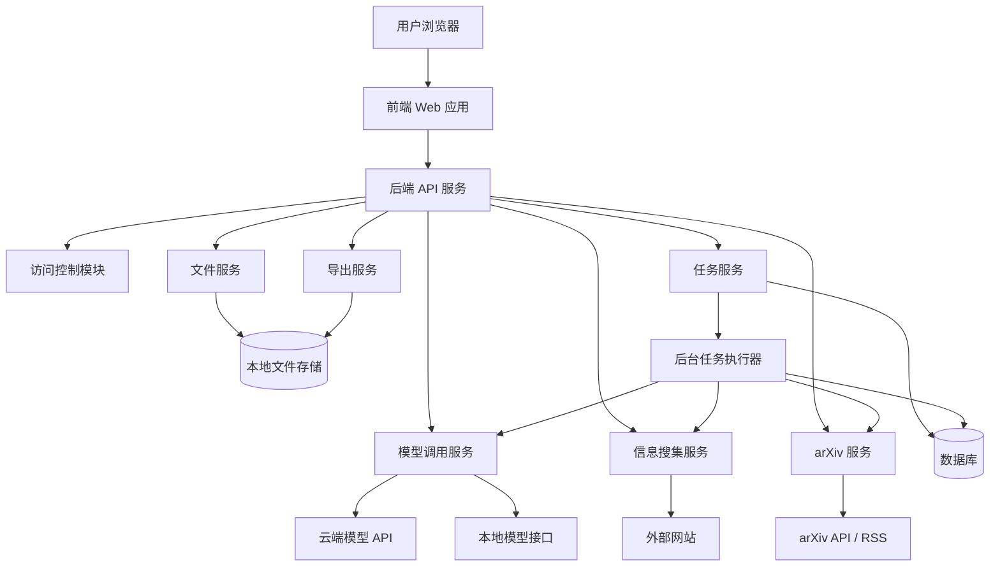

## 5. 分层架构

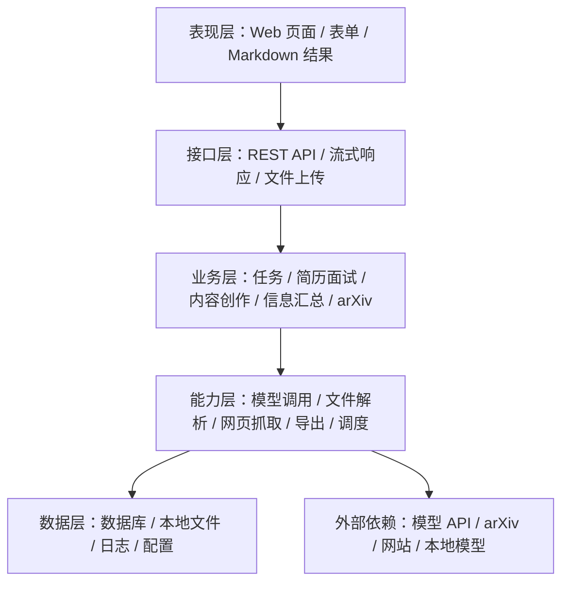

### 5.1 表现层

负责用户可见界面：

- 工作台首页。
- 任务创建页。
- 任务详情页。
- 文件管理页。
- 模型设置页。
- 简历面试页。
- 内容创作页。
- 信息搜集页。
- arXiv 日报页。
- 历史任务页。

### 5.2 接口层

负责前后端通信：

- REST API。
- 文件上传接口。
- 流式输出接口。
- 任务状态查询接口。
- 模型配置接口。
- 报告导出接口。

### 5.3 业务层

负责业务规则和流程编排：

- 任务创建。
- 任务执行。
- 任务状态流转。
- 简历面试流程。
- 内容创作流程。
- 信息搜集流程。
- arXiv 日报流程。

### 5.4 能力层

负责封装可复用能力：

- 模型调用。
- Prompt 模板渲染。
- 文件解析。
- 网页抓取。
- arXiv 拉取。
- Markdown 导出。
- 后台任务调度。

### 5.5 数据层

负责数据持久化：

- 任务数据。
- 文件元数据。
- 文件解析文本。
- 模型配置。
- Prompt 模板。
- arXiv 方向配置。
- arXiv 论文记录。
- 执行日志。

## 6. 核心模块设计

### 6.1 前端 Web 模块

职责：

- 展示页面。
- 收集用户输入。
- 上传文件。
- 展示任务状态。
- 渲染 Markdown 输出。
- 管理页面路由。
- 展示错误和空状态。

建议前端路由：

| 路由 | 页面 |
| --- | --- |
| `/` | 工作台首页 |
| `/tasks/new` | 任务创建页 |
| `/tasks/:id` | 任务详情页 |
| `/tasks` | 历史任务页 |
| `/files` | 文件管理页 |
| `/settings/models` | 模型设置页 |
| `/interview` | 简历与模拟面试页 |
| `/content` | 内容创作页 |
| `/research` | 信息搜集与汇总页 |
| `/arxiv` | arXiv 论文日报页 |

### 6.2 后端 API 模块

职责：

- 提供前端接口。
- 校验请求参数。
- 管理任务生命周期。
- 调用业务服务。
- 返回结构化响应。
- 处理错误。

建议接口风格：

- `/api/tasks`
- `/api/files`
- `/api/models`
- `/api/interview`
- `/api/content`
- `/api/research`
- `/api/arxiv`
- `/api/export`

### 6.3 任务服务

职责：

- 创建任务。
- 更新任务状态。
- 保存任务输入。
- 保存任务输出。
- 保存错误信息。
- 支持重试。
- 支持历史查询。

任务类型：

- `interview`
- `content`
- `research`
- `arxiv_daily`
- `generic`

任务状态：

- `draft`
- `queued`
- `running`
- `succeeded`
- `failed`
- `cancelled`

### 6.4 模型调用服务

职责：

- 统一管理模型 API 调用。
- 支持 OpenAI 兼容接口。
- 支持流式输出。
- 支持连接测试。
- 支持错误转换。
- 记录调用日志。
- 后续支持本地模型。

模型调用服务不应直接绑定某一个模型厂商。建议抽象统一接口：

```text
ModelClient.generate(input, options)
ModelClient.stream(input, options)
ModelClient.test_connection(config)
```

### 6.5 Prompt 模板服务

职责：

- 管理不同任务类型的 Prompt 模板。
- 根据任务输入渲染 Prompt。
- 固定输出结构。
- 注入文件上下文。
- 注入风险提示。

模板类型：

- 简历分析模板。
- 面试题生成模板。
- 回答评价模板。
- 内容大纲模板。
- 内容正文模板。
- 信息汇总模板。
- arXiv 论文摘要模板。

### 6.6 文件服务

职责：

- 上传文件。
- 保存原文件。
- 判断文件类型。
- 解析文件文本。
- 保存解析结果。
- 为任务提供上下文。

MVP 支持格式：

- Markdown。
- TXT。
- PDF。
- DOCX。

### 6.7 信息搜集服务

职责：

- 处理 URL 输入。
- 处理关键词输入。
- 抓取网页内容。
- 提取正文。
- 保留来源链接。
- 标记抓取状态。
- 汇总多来源内容。

MVP 建议：

- 普通静态网页使用 Requests + BeautifulSoup。
- 动态网页或复杂站点后续使用 Playwright。
- 对失败来源保留错误记录。

### 6.8 arXiv 服务

职责：

- 管理研究方向配置。
- 根据关键词和分类拉取论文。
- 去重。
- 筛选相关论文。
- 调用模型生成中文摘要。
- 生成日报。
- 保存历史日报。

数据来源：

- arXiv API。
- arXiv RSS。

### 6.9 导出服务

职责：

- 将任务结果导出为 Markdown。
- 保留标题、输入摘要、输出内容、来源链接和生成时间。
- 后续支持 PDF、DOCX。

## 7. 任务执行架构

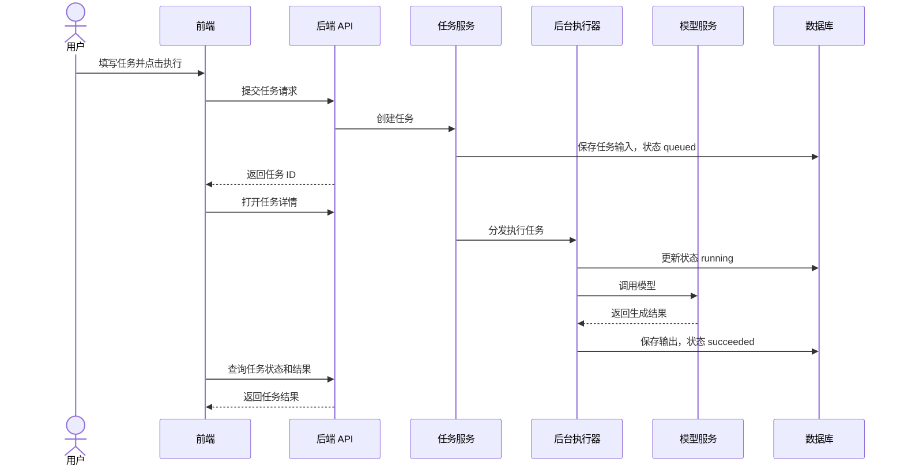

## 8. 流式输出架构

MVP 阶段可以先采用普通轮询或 Server-Sent Events。若开发复杂度需要控制，首版可以先实现非流式输出，再升级流式输出。

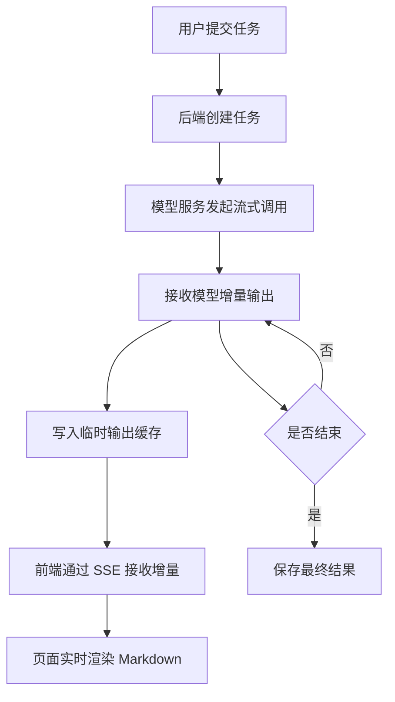

## 9. 文件处理链路

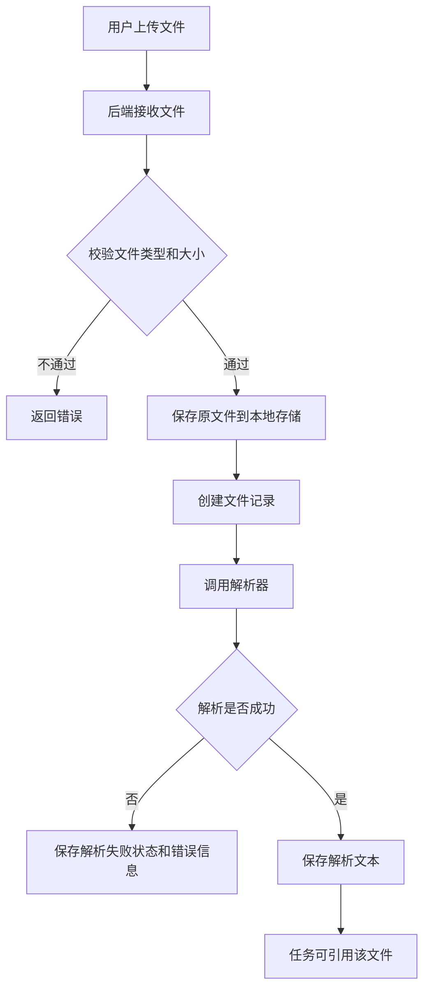

## 10. 信息搜集链路

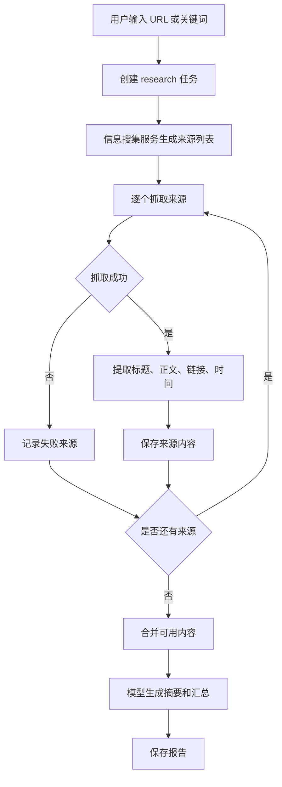

## 11. arXiv 日报链路

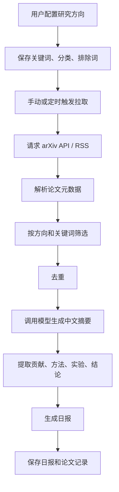

## 12. 数据存储架构

MVP 阶段建议使用关系型数据库保存核心业务数据，本地文件系统保存原始文件和导出文件。

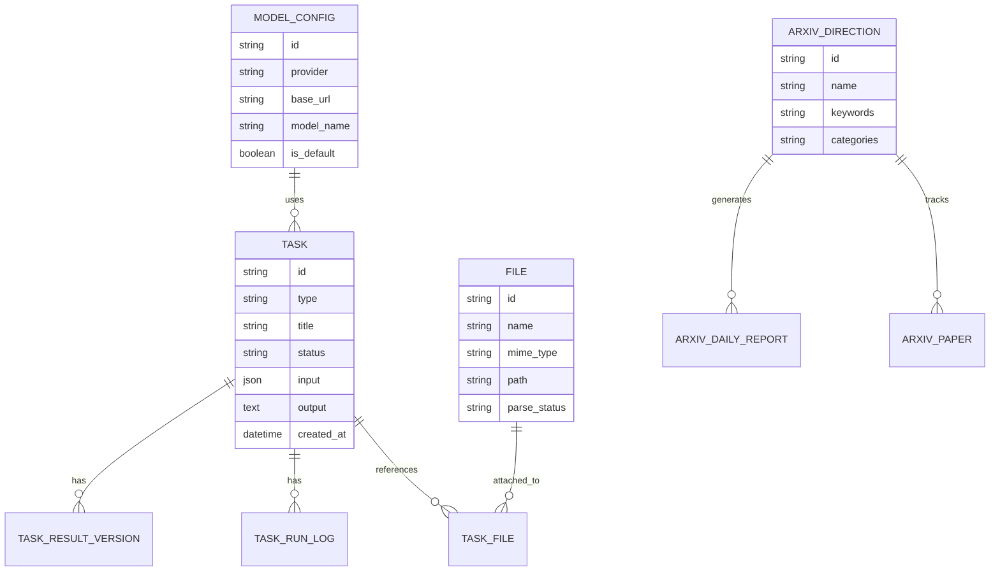

详细字段后续在《数据库设计文档》中展开。

## 13. 目录结构建议

如果采用 `Next.js + FastAPI` 前后端分离，建议目录如下：

```text
chenshu-ai/
  apps/
    web/
      app/
      components/
      lib/
      styles/
    api/
      app/
        main.py
        api/
        core/
        models/
        schemas/
        services/
        workers/
        templates/
  data/
    uploads/
    exports/
    sqlite/
  docs/
  scripts/
  docker-compose.yml
  README.md
```

如果希望更快启动，也可以先使用单后端模板渲染页面。但考虑后续产品化和复杂交互，仍建议前后端分离。

## 14. 部署架构

### 14.1 MVP 本地部署

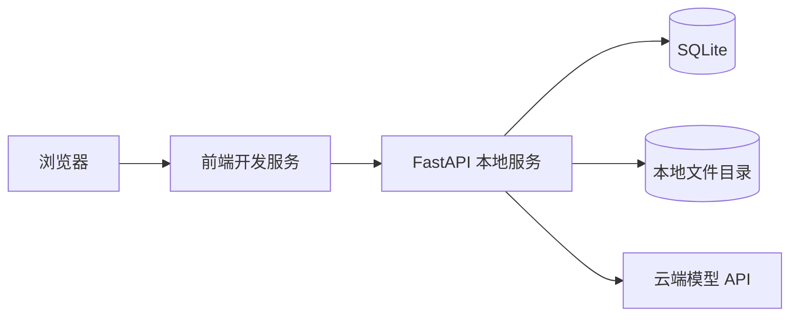

特点：

- 成本低。
- 部署简单。
- 适合个人验证。
- 不适合多人同时使用。

### 14.2 后期服务器部署

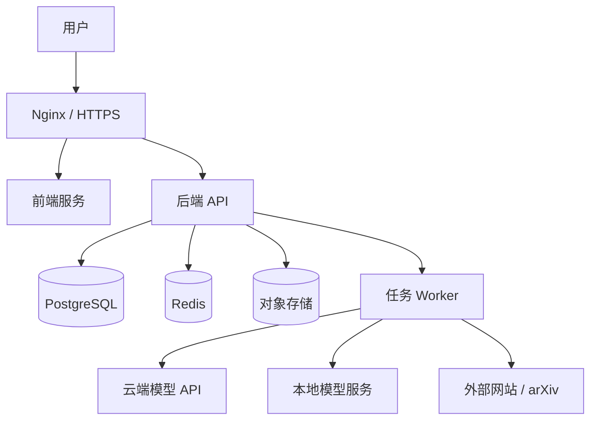

特点：

- 支持多人访问。
- 支持后台任务。
- 支持对象存储。
- 支持日志和监控。
- 可逐步接入本地模型。

## 15. 安全与隐私设计

### 15.1 API Key 安全

- 前端不长期保存 API Key。
- 后端保存时应加密或使用本地安全配置。
- 页面展示时默认脱敏。
- 日志中不得输出完整 API Key。

### 15.2 文件隐私

- 上传文件默认只在本地或私有服务器保存。
- 任务执行前应明确哪些文件内容会发送给模型 API。
- 支持删除文件和解析文本。
- 后续高隐私任务可优先走本地模型。

### 15.3 外部请求安全

- 网页抓取应限制超时时间。
- 不执行未知网页中的脚本逻辑。
- 后续需要增加访问白名单或抓取规则。
- 遵守目标网站规则。

### 15.4 输出风险提示

- 股票报告必须包含非投资建议说明。
- 专利和论文输出必须提示用户复核真实性和合规性。
- 信息汇总必须保留来源。

## 16. 日志与错误处理

### 16.1 日志类型

- API 请求日志。
- 任务执行日志。
- 模型调用日志。
- 文件解析日志。
- 网页抓取日志。
- arXiv 拉取日志。
- 错误日志。

### 16.2 错误处理原则

- 错误需要转成用户可理解的提示。
- 任务失败需要保留错误原因。
- 单个来源失败不能影响整个信息汇总任务。
- 模型调用失败应允许重试。
- 文件解析失败应允许重新解析或更换文件。

## 17. 扩展架构

### 17.1 本地模型扩展

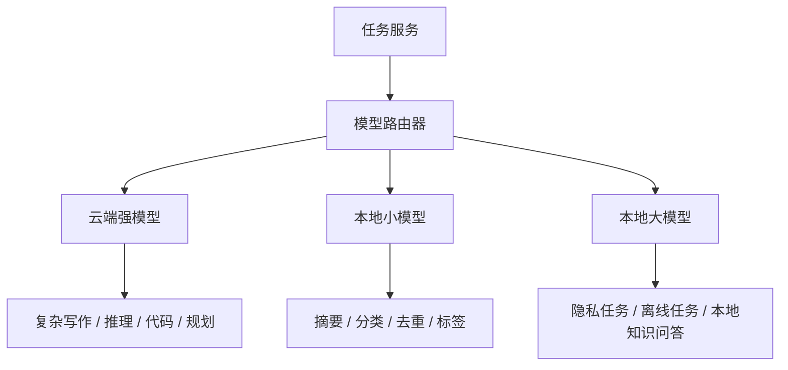

路由依据：

- 任务复杂度。
- 隐私等级。
- 成本预算。
- 响应速度。
- 上下文长度。

### 17.2 RAG 扩展

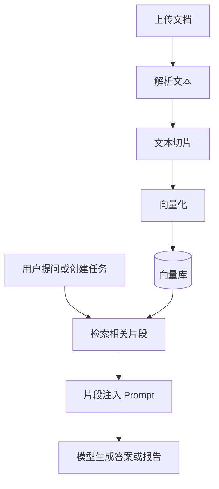

适用场景：

- 论文资料库。
- 个人简历和项目库。
- 长期写作素材库。
- 股票研究资料库。
- 历史报告复用。

### 17.3 微调扩展

微调不建议作为 MVP 依赖。后续只有在以下情况明确时再考虑：

- 有稳定任务格式。
- 有足够高质量样本。
- RAG 无法满足风格或格式要求。
- 成本收益明确。

优先微调方向：

- 固定格式报告。
- 特定写作风格。
- 简历点评口径。
- 论文摘要结构。

## 18. 技术风险与应对

| 风险 | 说明 | 应对 |
| --- | --- | --- |
| 范围过大 | 模块多，容易拖慢 MVP | 先实现 P0，P1/P2 只预留接口 |
| 模型调用不稳定 | API 超时、限流、错误 | 增加重试、错误日志、状态展示 |
| 文件解析质量不稳定 | PDF/DOCX 结构复杂 | 先支持文本提取，复杂格式后续优化 |
| 网页抓取失败 | 反爬、登录、动态渲染 | 优先公开 API/RSS，失败可跳过 |
| 成本不可控 | 长文本和自动任务消耗高 | 增加日志和成本统计 |
| 隐私风险 | 简历和资料会发送外部 API | 增加提示，后续接入本地模型 |
| 架构过早复杂 | 过早引入队列、微服务、向量库 | MVP 使用模块化单体 |

## 19. MVP 技术验收标准

MVP 技术架构达到以下标准即可进入开发：

1. 前端页面可以通过 API 创建任务。
2. 后端可以保存任务、文件和模型配置。
3. 系统可以调用至少一个 OpenAI 兼容模型。
4. 系统可以上传并解析 Markdown、TXT、PDF、DOCX。
5. 系统可以保存任务执行状态和输出结果。
6. 系统可以执行简历、内容创作、信息汇总、arXiv 日报任务。
7. 系统可以导出 Markdown。
8. 任务失败时有错误记录。
9. 架构预留本地模型、RAG 和定时任务扩展点。

## 20. 后续文档衔接

本技术架构设计完成后，建议继续编写：

1. 《数据库设计文档》。
2. 《API 接口设计文档》。
3. 《开发规范文档》。
4. 《部署运行文档》。
5. 《测试用例与上线检查清单》。
