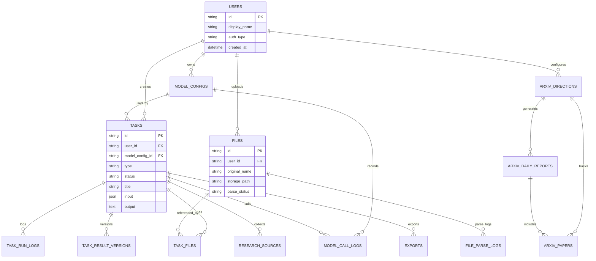
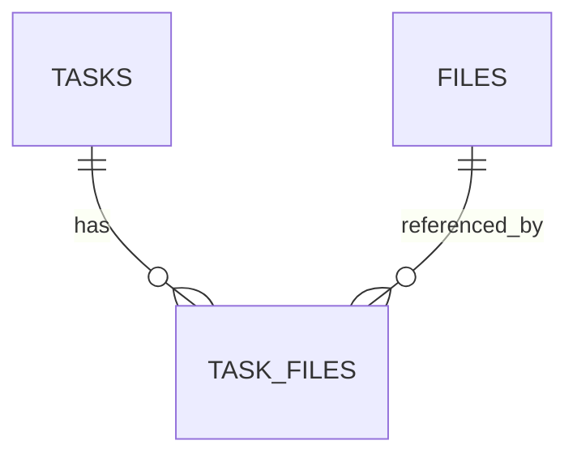
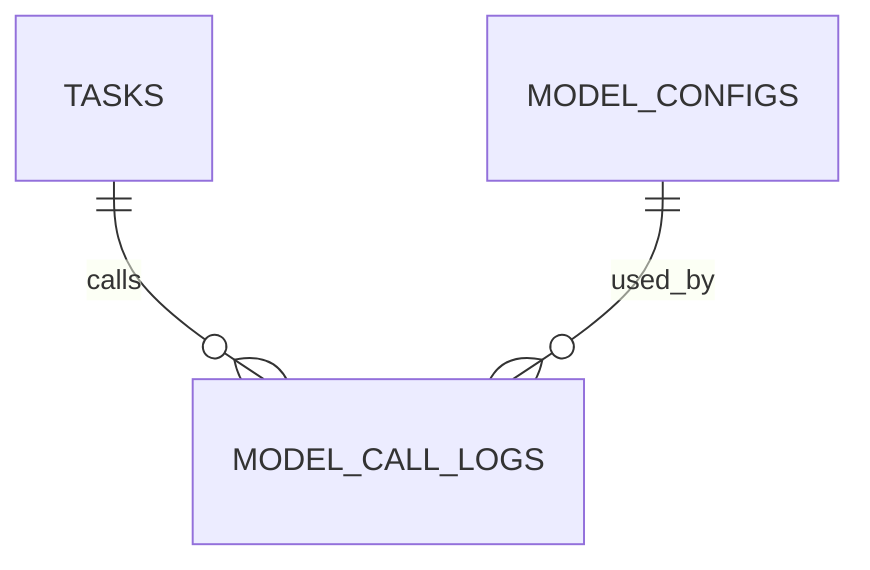
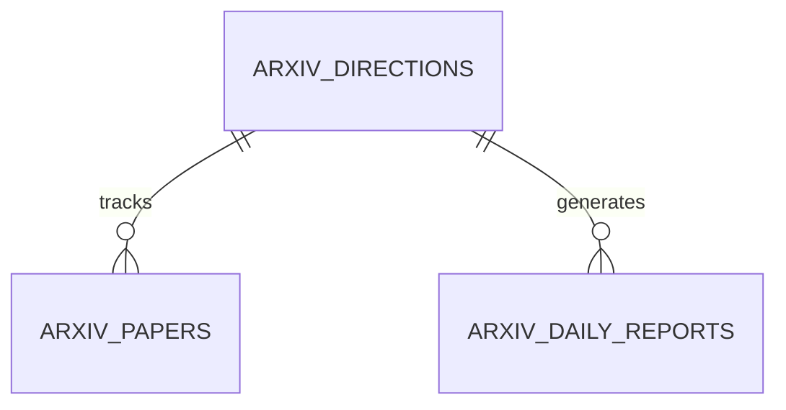
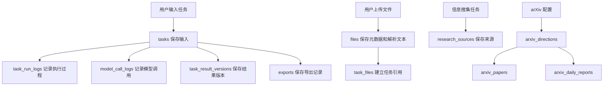

# 晨枢 AI - 产品类 - 数据库设计文档

## 清单

### 7 个步骤

- [x] 立项与产品定位
- [x] 需求分析
- [x] 原型与交互设计
- [x] 技术架构设计
- [x] 开发与工程化
- [x] 测试与上线准备
- [ ] 迭代与产品化

### 12 份文档

- [x] 项目立项文档
- [x] 产品定位与范围说明
- [x] PRD 产品需求文档
- [x] MVP 功能清单与优先级
- [x] 页面原型说明
- [x] 用户流程图 / 任务流程图
- [x] 技术架构设计文档
- [x] 数据库设计文档
- [x] API 接口设计文档
- [x] 开发规范文档
- [x] 部署运行文档
- [x] 测试用例与上线检查清单

---

## 1. 文档目的

本文档用于说明晨枢 AI MVP 阶段的数据库设计，包括核心实体、表结构、字段说明、关系设计、索引建议、状态枚举、数据生命周期和后续扩展方案。

数据库设计目标是先支持个人自用 MVP 稳定运行，同时为后续上线、多用户、本地模型、RAG、定时任务、股票研究和成本统计预留扩展空间。

## 2. 设计原则

1. 任务为核心。
   所有 AI 生成、文件引用、模型调用、报告导出和执行日志都围绕 `tasks` 表组织。

2. MVP 简洁优先。
   首版不做过度范式化，允许在任务输入和输出中使用 JSON 字段保存灵活参数。

3. 可迁移。
   MVP 可使用 SQLite，后续应能迁移到 PostgreSQL。

4. 可追踪。
   任务、模型调用、文件解析和外部抓取都需要保存状态和错误信息。

5. 敏感信息隔离。
   API Key、简历、研究资料等敏感内容需要明确存储位置和展示规则。

6. 扩展友好。
   对 RAG、定时任务、本地模型、多用户和股票研究预留扩展表。

## 3. 数据库选型

### 3.1 MVP 阶段

推荐：SQLite。

原因：

- 本地部署简单。
- 无需额外数据库服务。
- 适合个人自用和快速验证。
- 方便备份和迁移。

### 3.2 上线阶段

推荐：PostgreSQL。

原因：

- 支持多用户和并发。
- 支持 JSONB。
- 可通过 pgvector 扩展支持向量检索。
- 生态成熟，适合后续 SaaS 化。

## 4. 数据域划分

```mermaid
flowchart TD
    A[晨枢 AI 数据库] --> B[用户与配置域]
    A --> C[任务域]
    A --> D[文件域]
    A --> E[模型调用域]
    A --> F[arXiv 研究域]
    A --> G[信息搜集域]
    A --> H[导出与版本域]
    A --> I[后续扩展域]

    B --> B1[users]
    B --> B2[model_configs]
    B --> B3[prompt_templates]

    C --> C1[tasks]
    C --> C2[task_files]
    C --> C3[task_run_logs]
    C --> C4[task_result_versions]

    D --> D1[files]
    D --> D2[file_parse_logs]

    E --> E1[model_call_logs]

    F --> F1[arxiv_directions]
    F --> F2[arxiv_papers]
    F --> F3[arxiv_daily_reports]

    G --> G1[research_sources]

    H --> H1[exports]

    I --> I1[scheduled_jobs]
    I --> I2[knowledge_documents]
    I --> I3[knowledge_chunks]
    I --> I4[stock_watchlists]
```



## 5. 核心 ER 图



## 6. MVP 必需表总览

| 表名 | 中文说明 | MVP 是否必需 |
| --- | --- | --- |
| `users` | 用户表，MVP 可单用户 | 是 |
| `model_configs` | 模型 API 配置表 | 是 |
| `prompt_templates` | Prompt 模板表 | 建议 |
| `files` | 文件表 | 是 |
| `file_parse_logs` | 文件解析日志表 | 建议 |
| `tasks` | 任务主表 | 是 |
| `task_files` | 任务文件关联表 | 是 |
| `task_run_logs` | 任务执行日志表 | 是 |
| `task_result_versions` | 任务结果版本表 | 建议 |
| `model_call_logs` | 模型调用日志表 | 建议 |
| `research_sources` | 信息搜集来源表 | 是 |
| `arxiv_directions` | arXiv 方向配置表 | 是 |
| `arxiv_papers` | arXiv 论文表 | 是 |
| `arxiv_daily_reports` | arXiv 日报表 | 是 |
| `exports` | 导出记录表 | 建议 |

## 7. 表结构设计

### 7.1 users

用途：保存用户信息。MVP 阶段可以只有一个默认用户，后续多用户时扩展。

| 字段 | 类型 | 必填 | 说明 |
| --- | --- | --- | --- |
| `id` | string | 是 | 用户 ID，建议 UUID |
| `display_name` | string | 是 | 显示名称 |
| `email` | string | 否 | 邮箱，后续上线使用 |
| `auth_type` | string | 是 | `local`、`none`、`oauth` |
| `password_hash` | string | 否 | 私有部署密码哈希 |
| `created_at` | datetime | 是 | 创建时间 |
| `updated_at` | datetime | 是 | 更新时间 |
| `deleted_at` | datetime | 否 | 软删除时间 |

索引：

- `idx_users_email`
- `idx_users_created_at`

### 7.2 model_configs

用途：保存模型 API 配置。

| 字段 | 类型 | 必填 | 说明 |
| --- | --- | --- | --- |
| `id` | string | 是 | 配置 ID |
| `user_id` | string | 是 | 所属用户 |
| `provider` | string | 是 | 模型服务商 |
| `base_url` | string | 是 | API Base URL |
| `api_key_encrypted` | text | 否 | 加密后的 API Key |
| `model_name` | string | 是 | 模型名称 |
| `display_name` | string | 否 | 页面展示名称 |
| `is_default` | boolean | 是 | 是否默认模型 |
| `is_enabled` | boolean | 是 | 是否启用 |
| `last_test_status` | string | 否 | `success`、`failed`、`unknown` |
| `last_test_error` | text | 否 | 最近测试错误 |
| `created_at` | datetime | 是 | 创建时间 |
| `updated_at` | datetime | 是 | 更新时间 |

索引：

- `idx_model_configs_user_id`
- `idx_model_configs_default`
- `idx_model_configs_enabled`

安全说明：

- `api_key_encrypted` 不应明文保存。
- 日志中禁止打印完整 API Key。
- 前端展示时只显示脱敏值。

### 7.3 prompt_templates

用途：保存不同任务类型的 Prompt 模板。

| 字段 | 类型 | 必填 | 说明 |
| --- | --- | --- | --- |
| `id` | string | 是 | 模板 ID |
| `task_type` | string | 是 | 任务类型 |
| `name` | string | 是 | 模板名称 |
| `version` | string | 是 | 模板版本 |
| `system_prompt` | text | 否 | 系统提示词 |
| `user_prompt_template` | text | 是 | 用户提示词模板 |
| `output_schema` | json | 否 | 输出结构约束 |
| `is_active` | boolean | 是 | 是否启用 |
| `created_at` | datetime | 是 | 创建时间 |
| `updated_at` | datetime | 是 | 更新时间 |

索引：

- `idx_prompt_templates_task_type`
- `idx_prompt_templates_active`

### 7.4 files

用途：保存上传文件元数据和解析结果。

| 字段 | 类型 | 必填 | 说明 |
| --- | --- | --- | --- |
| `id` | string | 是 | 文件 ID |
| `user_id` | string | 是 | 上传用户 |
| `original_name` | string | 是 | 原始文件名 |
| `storage_name` | string | 是 | 存储文件名 |
| `storage_path` | string | 是 | 本地存储路径 |
| `mime_type` | string | 否 | MIME 类型 |
| `extension` | string | 否 | 文件扩展名 |
| `size_bytes` | integer | 是 | 文件大小 |
| `sha256` | string | 否 | 文件哈希，用于去重 |
| `parse_status` | string | 是 | 文件解析状态 |
| `parsed_text` | text | 否 | 解析后的文本 |
| `parse_error` | text | 否 | 解析错误 |
| `created_at` | datetime | 是 | 上传时间 |
| `updated_at` | datetime | 是 | 更新时间 |
| `deleted_at` | datetime | 否 | 删除时间 |

索引：

- `idx_files_user_id`
- `idx_files_parse_status`
- `idx_files_sha256`
- `idx_files_created_at`

### 7.5 file_parse_logs

用途：保存文件解析过程日志，便于排查 PDF、DOCX 解析问题。

| 字段 | 类型 | 必填 | 说明 |
| --- | --- | --- | --- |
| `id` | string | 是 | 日志 ID |
| `file_id` | string | 是 | 文件 ID |
| `status` | string | 是 | `started`、`success`、`failed` |
| `parser_name` | string | 否 | 解析器名称 |
| `message` | text | 否 | 日志信息 |
| `error` | text | 否 | 错误详情 |
| `created_at` | datetime | 是 | 创建时间 |

索引：

- `idx_file_parse_logs_file_id`
- `idx_file_parse_logs_status`

### 7.6 tasks

用途：任务主表，是系统最核心的数据表。

| 字段 | 类型 | 必填 | 说明 |
| --- | --- | --- | --- |
| `id` | string | 是 | 任务 ID |
| `user_id` | string | 是 | 创建用户 |
| `model_config_id` | string | 否 | 使用的模型配置 |
| `type` | string | 是 | 任务类型 |
| `title` | string | 是 | 任务标题 |
| `description` | text | 否 | 任务描述 |
| `status` | string | 是 | 任务状态 |
| `input` | json | 是 | 任务输入参数 |
| `output` | text | 否 | 当前最终输出 |
| `output_format` | string | 是 | `markdown` 等 |
| `error_message` | text | 否 | 失败原因 |
| `started_at` | datetime | 否 | 开始时间 |
| `finished_at` | datetime | 否 | 结束时间 |
| `created_at` | datetime | 是 | 创建时间 |
| `updated_at` | datetime | 是 | 更新时间 |
| `deleted_at` | datetime | 否 | 删除时间 |

索引：

- `idx_tasks_user_id`
- `idx_tasks_type`
- `idx_tasks_status`
- `idx_tasks_created_at`
- `idx_tasks_updated_at`

任务类型：

- `interview`
- `content`
- `research`
- `arxiv_daily`
- `generic`
- `stock_research`

任务状态：

- `draft`
- `queued`
- `running`
- `succeeded`
- `failed`
- `cancelled`

### 7.7 task_files

用途：任务与文件的多对多关联表。

| 字段 | 类型 | 必填 | 说明 |
| --- | --- | --- | --- |
| `id` | string | 是 | 关联 ID |
| `task_id` | string | 是 | 任务 ID |
| `file_id` | string | 是 | 文件 ID |
| `usage_type` | string | 是 | `context`、`resume`、`material` |
| `created_at` | datetime | 是 | 创建时间 |

索引：

- `idx_task_files_task_id`
- `idx_task_files_file_id`
- `idx_task_files_usage_type`

唯一约束：

- `unique_task_file_usage(task_id, file_id, usage_type)`

### 7.8 task_run_logs

用途：保存任务执行过程日志。

| 字段 | 类型 | 必填 | 说明 |
| --- | --- | --- | --- |
| `id` | string | 是 | 日志 ID |
| `task_id` | string | 是 | 任务 ID |
| `level` | string | 是 | `info`、`warning`、`error` |
| `step` | string | 否 | 执行步骤 |
| `message` | text | 是 | 日志内容 |
| `metadata` | json | 否 | 附加信息 |
| `created_at` | datetime | 是 | 创建时间 |

索引：

- `idx_task_run_logs_task_id`
- `idx_task_run_logs_level`
- `idx_task_run_logs_created_at`

### 7.9 task_result_versions

用途：保存同一任务的多个输出版本。

| 字段 | 类型 | 必填 | 说明 |
| --- | --- | --- | --- |
| `id` | string | 是 | 版本 ID |
| `task_id` | string | 是 | 任务 ID |
| `version_no` | integer | 是 | 版本号 |
| `title` | string | 否 | 版本标题 |
| `content` | text | 是 | 输出内容 |
| `source` | string | 是 | `generated`、`edited`、`regenerated` |
| `created_at` | datetime | 是 | 创建时间 |

索引：

- `idx_task_result_versions_task_id`
- `idx_task_result_versions_created_at`

唯一约束：

- `unique_task_version(task_id, version_no)`

### 7.10 model_call_logs

用途：记录模型调用情况，后续用于成本统计和错误排查。

| 字段 | 类型 | 必填 | 说明 |
| --- | --- | --- | --- |
| `id` | string | 是 | 调用日志 ID |
| `task_id` | string | 否 | 关联任务 |
| `model_config_id` | string | 否 | 模型配置 |
| `provider` | string | 是 | 模型服务商 |
| `model_name` | string | 是 | 模型名称 |
| `request_type` | string | 是 | `generate`、`stream`、`test` |
| `status` | string | 是 | `success`、`failed` |
| `prompt_tokens` | integer | 否 | 输入 token |
| `completion_tokens` | integer | 否 | 输出 token |
| `total_tokens` | integer | 否 | 总 token |
| `estimated_cost` | decimal | 否 | 估算成本 |
| `latency_ms` | integer | 否 | 延迟 |
| `error_message` | text | 否 | 错误信息 |
| `created_at` | datetime | 是 | 创建时间 |

索引：

- `idx_model_call_logs_task_id`
- `idx_model_call_logs_model_config_id`
- `idx_model_call_logs_status`
- `idx_model_call_logs_created_at`

### 7.11 research_sources

用途：保存信息搜集任务中的每个来源。

| 字段 | 类型 | 必填 | 说明 |
| --- | --- | --- | --- |
| `id` | string | 是 | 来源 ID |
| `task_id` | string | 是 | 关联任务 |
| `source_type` | string | 是 | `url`、`search_result` |
| `url` | text | 是 | 来源链接 |
| `title` | string | 否 | 页面标题 |
| `author` | string | 否 | 作者 |
| `published_at` | datetime | 否 | 发布时间 |
| `fetched_at` | datetime | 否 | 抓取时间 |
| `fetch_status` | string | 是 | 抓取状态 |
| `raw_text` | text | 否 | 原始正文 |
| `summary` | text | 否 | 单来源摘要 |
| `error_message` | text | 否 | 失败原因 |
| `created_at` | datetime | 是 | 创建时间 |

索引：

- `idx_research_sources_task_id`
- `idx_research_sources_fetch_status`
- `idx_research_sources_url`

### 7.12 arxiv_directions

用途：保存用户关注的 arXiv 研究方向。

| 字段 | 类型 | 必填 | 说明 |
| --- | --- | --- | --- |
| `id` | string | 是 | 方向 ID |
| `user_id` | string | 是 | 所属用户 |
| `name` | string | 是 | 方向名称 |
| `keywords` | json | 是 | 关键词列表 |
| `exclude_keywords` | json | 否 | 排除词列表 |
| `categories` | json | 否 | arXiv 分类 |
| `is_enabled` | boolean | 是 | 是否启用 |
| `last_run_at` | datetime | 否 | 最近运行时间 |
| `created_at` | datetime | 是 | 创建时间 |
| `updated_at` | datetime | 是 | 更新时间 |

索引：

- `idx_arxiv_directions_user_id`
- `idx_arxiv_directions_enabled`

### 7.13 arxiv_papers

用途：保存拉取到的 arXiv 论文记录。

| 字段 | 类型 | 必填 | 说明 |
| --- | --- | --- | --- |
| `id` | string | 是 | 内部论文 ID |
| `direction_id` | string | 是 | 研究方向 ID |
| `arxiv_id` | string | 是 | arXiv ID |
| `title` | text | 是 | 标题 |
| `authors` | json | 否 | 作者列表 |
| `abstract` | text | 否 | 原始摘要 |
| `summary_zh` | text | 否 | 中文摘要 |
| `pdf_url` | text | 否 | PDF 链接 |
| `abs_url` | text | 否 | 摘要页链接 |
| `published_at` | datetime | 否 | 发布时间 |
| `updated_at_arxiv` | datetime | 否 | arXiv 更新时间 |
| `categories` | json | 否 | 分类 |
| `relevance_score` | decimal | 否 | 相关性分数 |
| `recommendation_reason` | text | 否 | 推荐理由 |
| `is_starred` | boolean | 是 | 是否收藏 |
| `created_at` | datetime | 是 | 创建时间 |

索引：

- `idx_arxiv_papers_direction_id`
- `idx_arxiv_papers_arxiv_id`
- `idx_arxiv_papers_published_at`
- `idx_arxiv_papers_relevance_score`

唯一约束：

- `unique_direction_arxiv(direction_id, arxiv_id)`

### 7.14 arxiv_daily_reports

用途：保存每日论文简报。

| 字段 | 类型 | 必填 | 说明 |
| --- | --- | --- | --- |
| `id` | string | 是 | 日报 ID |
| `direction_id` | string | 是 | 研究方向 ID |
| `report_date` | date | 是 | 日报日期 |
| `title` | string | 是 | 日报标题 |
| `content` | text | 是 | Markdown 内容 |
| `paper_count` | integer | 是 | 论文数量 |
| `recommended_count` | integer | 是 | 推荐精读数量 |
| `status` | string | 是 | `generated`、`failed` |
| `error_message` | text | 否 | 错误信息 |
| `created_at` | datetime | 是 | 创建时间 |

索引：

- `idx_arxiv_daily_reports_direction_id`
- `idx_arxiv_daily_reports_report_date`

唯一约束：

- `unique_direction_report_date(direction_id, report_date)`

### 7.15 exports

用途：保存导出记录。

| 字段 | 类型 | 必填 | 说明 |
| --- | --- | --- | --- |
| `id` | string | 是 | 导出 ID |
| `task_id` | string | 否 | 关联任务 |
| `user_id` | string | 是 | 用户 ID |
| `export_type` | string | 是 | `markdown`、后续 `pdf`、`docx` |
| `file_path` | string | 是 | 导出文件路径 |
| `file_name` | string | 是 | 导出文件名 |
| `created_at` | datetime | 是 | 创建时间 |

索引：

- `idx_exports_task_id`
- `idx_exports_user_id`
- `idx_exports_created_at`

## 8. 关键关系说明

### 8.1 任务与文件

一个任务可以引用多个文件，一个文件也可以被多个任务引用，因此使用 `task_files` 作为中间表。



### 8.2 任务与模型调用

一个任务可能多次调用模型，例如先生成大纲，再生成正文，再进行润色。因此模型调用日志需要独立保存。



### 8.3 arXiv 方向与论文日报

一个研究方向可以生成多份日报，也可以追踪多篇论文。



## 9. 状态枚举

### 9.1 task_status

| 状态 | 说明 |
| --- | --- |
| `draft` | 草稿 |
| `queued` | 已提交，等待执行 |
| `running` | 执行中 |
| `succeeded` | 执行成功 |
| `failed` | 执行失败 |
| `cancelled` | 已取消 |

### 9.2 file_parse_status

| 状态 | 说明 |
| --- | --- |
| `uploaded` | 已上传 |
| `parsing` | 解析中 |
| `parsed` | 解析成功 |
| `failed` | 解析失败 |

### 9.3 fetch_status

| 状态 | 说明 |
| --- | --- |
| `pending` | 待抓取 |
| `fetching` | 抓取中 |
| `succeeded` | 抓取成功 |
| `failed` | 抓取失败 |
| `skipped` | 已跳过 |

### 9.4 model_call_status

| 状态 | 说明 |
| --- | --- |
| `success` | 调用成功 |
| `failed` | 调用失败 |
| `timeout` | 调用超时 |
| `cancelled` | 调用取消 |

## 10. 数据流图



## 11. 索引策略

MVP 阶段重点优化以下查询：

- 最近任务列表：`tasks.user_id + tasks.updated_at`
- 按任务类型筛选：`tasks.user_id + tasks.type`
- 按状态筛选：`tasks.user_id + tasks.status`
- 文件列表：`files.user_id + files.created_at`
- arXiv 日报：`arxiv_daily_reports.direction_id + report_date`
- arXiv 论文去重：`arxiv_papers.direction_id + arxiv_id`
- 模型调用统计：`model_call_logs.created_at + model_name`

建议复合索引：

```sql
CREATE INDEX idx_tasks_user_updated ON tasks(user_id, updated_at);
CREATE INDEX idx_tasks_user_type ON tasks(user_id, type);
CREATE INDEX idx_tasks_user_status ON tasks(user_id, status);
CREATE INDEX idx_files_user_created ON files(user_id, created_at);
CREATE INDEX idx_model_logs_created_model ON model_call_logs(created_at, model_name);
```

## 12. 软删除策略

建议以下表支持软删除：

- `users`
- `files`
- `tasks`

软删除字段：

- `deleted_at`

原则：

- 默认查询过滤 `deleted_at IS NULL`。
- 删除任务不必立刻删除关联日志。
- 删除文件时需要判断是否仍被任务引用。
- 后续可提供“彻底删除”能力。

## 13. 敏感数据处理

### 13.1 API Key

- 存储在 `model_configs.api_key_encrypted`。
- 必须加密保存。
- 页面只显示脱敏后的 Key。
- 日志中不能写入完整 Key。

### 13.2 简历和个人资料

- 文件原文保存在 `files.parsed_text` 和本地文件路径中。
- 需要支持删除。
- 后续可增加本地模型优先处理选项。

### 13.3 模型输入输出

- `tasks.input` 和 `tasks.output` 可能包含敏感内容。
- 后续上线时需要增加用户隔离和访问控制。

## 14. 备份与迁移

### 14.1 MVP SQLite 备份

备份内容：

- SQLite 数据库文件。
- `uploads` 文件目录。
- `exports` 导出目录。

备份建议：

- 每日手动或自动复制一次。
- 保留最近 7 个备份。
- 文件和数据库需要保持同一时间点。

### 14.2 迁移到 PostgreSQL

迁移重点：

- JSON 字段迁移为 JSONB。
- 时间字段统一时区。
- UUID 字段保持字符串或使用 PostgreSQL UUID 类型。
- 后续向量字段可使用 pgvector。

## 15. 后续扩展表

### 15.1 scheduled_jobs

用途：保存定时任务配置。

关键字段：

- `id`
- `user_id`
- `job_type`
- `name`
- `cron_expr`
- `status`
- `last_run_at`
- `next_run_at`
- `config`
- `created_at`

### 15.2 knowledge_documents

用途：保存知识库文档。

关键字段：

- `id`
- `user_id`
- `file_id`
- `title`
- `source_type`
- `status`
- `created_at`

### 15.3 knowledge_chunks

用途：保存文档切片和向量索引引用。

关键字段：

- `id`
- `document_id`
- `chunk_index`
- `content`
- `embedding_id`
- `metadata`
- `created_at`

### 15.4 stock_watchlists

用途：保存股票关注列表。

关键字段：

- `id`
- `user_id`
- `name`
- `symbols`
- `market`
- `is_enabled`
- `created_at`

### 15.5 stock_reports

用途：保存股票研究报告。

关键字段：

- `id`
- `watchlist_id`
- `report_date`
- `content`
- `source_count`
- `risk_summary`
- `created_at`

## 16. 开发表结构优先级

### 16.1 第一批必须建表

- `users`
- `model_configs`
- `files`
- `tasks`
- `task_files`
- `task_run_logs`

### 16.2 第二批建议建表

- `prompt_templates`
- `task_result_versions`
- `model_call_logs`
- `research_sources`
- `exports`

### 16.3 第三批场景表

- `arxiv_directions`
- `arxiv_papers`
- `arxiv_daily_reports`

### 16.4 后续扩展表

- `scheduled_jobs`
- `knowledge_documents`
- `knowledge_chunks`
- `stock_watchlists`
- `stock_reports`

## 17. MVP 数据库验收标准

数据库设计在 MVP 阶段应满足：

1. 可以保存模型配置。
2. 可以保存上传文件和解析文本。
3. 可以创建任务并保存输入、状态、输出和错误信息。
4. 可以关联任务和文件。
5. 可以记录任务执行日志。
6. 可以保存模型调用日志。
7. 可以保存信息搜集来源和摘要。
8. 可以保存 arXiv 方向、论文和日报。
9. 可以导出任务结果并记录导出文件。
10. 后续可以平滑迁移到 PostgreSQL。

## 18. 后续文档衔接

本数据库设计文档完成后，建议继续编写：

1. 《API 接口设计文档》。
2. 《开发规范文档》。
3. 《部署运行文档》。
4. 《测试用例与上线检查清单》。
