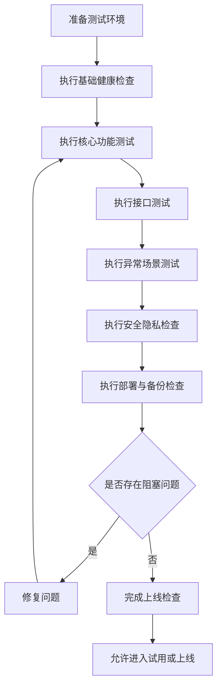
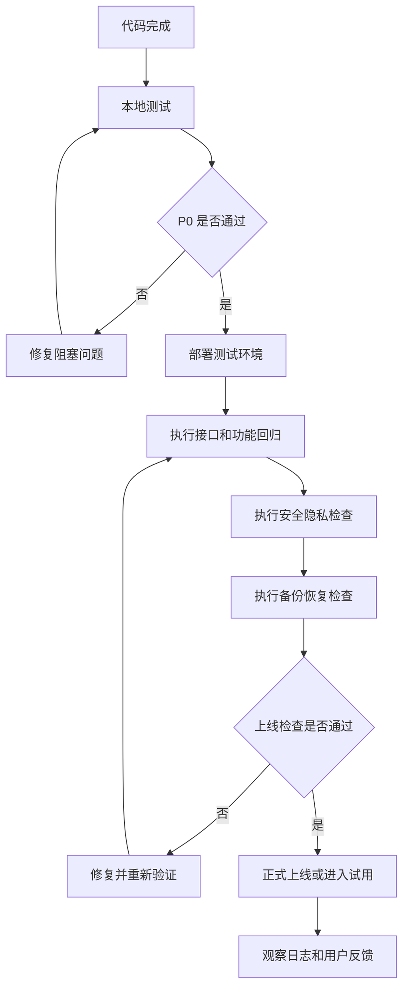

# 晨枢 AI - 产品类 - 测试用例与上线检查清单

## 清单

### 7 个步骤

- [x] 立项与产品定位
- [x] 需求分析
- [x] 原型与交互设计
- [x] 技术架构设计
- [x] 开发与工程化
- [x] 测试与上线准备
- [ ] 迭代与产品化

### 12 份文档

- [x] 项目立项文档
- [x] 产品定位与范围说明
- [x] PRD 产品需求文档
- [x] MVP 功能清单与优先级
- [x] 页面原型说明
- [x] 用户流程图 / 任务流程图
- [x] 技术架构设计文档
- [x] 数据库设计文档
- [x] API 接口设计文档
- [x] 开发规范文档
- [x] 部署运行文档
- [x] 测试用例与上线检查清单

---

## 1. 文档目的

本文档用于定义晨枢 AI MVP 阶段的测试用例、验收标准和上线检查清单，确保产品在个人自用、私有部署或小范围试用前具备基本可用性、稳定性、安全性和可恢复性。

本文档既是测试执行参考，也是上线前最后一道人工检查清单。

## 2. 测试范围

MVP 阶段测试范围包括：

- 工作台首页。
- 模型配置。
- 文件上传与解析。
- 通用任务系统。
- 简历分析与模拟面试。
- 内容创作。
- 信息搜集与汇总。
- arXiv 论文日报。
- 历史任务与导出。
- API 接口。
- 数据库读写。
- 部署运行。
- 安全隐私。
- 异常处理。

暂不纳入 MVP 测试范围：

- 多用户团队协作。
- 支付订阅。
- 完整本地模型管理。
- 模型微调平台。
- 自动交易。
- 大规模并发压测。

## 3. 测试流程图



## 4. 测试环境要求

### 4.1 本地测试环境

| 项目 | 要求 |
| --- | --- |
| 前端 | Next.js 可正常启动 |
| 后端 | FastAPI 可正常启动 |
| 数据库 | SQLite 初始化完成 |
| 文件目录 | uploads、exports 可读写 |
| 模型配置 | 至少一个 OpenAI 兼容模型可用 |
| 浏览器 | Chrome 或 Edge |

### 4.2 上线前测试环境

| 项目 | 要求 |
| --- | --- |
| 服务器 | 服务可稳定运行 |
| HTTPS | 已配置 |
| 数据库 | PostgreSQL 或稳定 SQLite |
| 备份 | 已完成一次备份恢复演练 |
| 日志 | API、任务、错误日志可查看 |
| 认证 | 私有部署或公网部署已开启访问控制 |

## 5. 测试优先级

### 5.1 P0 阻塞问题

出现以下问题不得上线：

- 服务无法启动。
- 无法访问首页。
- 无法配置模型。
- 无法创建任务。
- 核心任务无法执行。
- 文件上传或解析完全不可用。
- 数据无法保存。
- API Key 明文泄露。
- 上传文件可被未授权访问。
- 无法恢复备份。

### 5.2 P1 重要问题

上线前建议修复：

- 错误提示不清晰。
- 某些文件格式解析不稳定。
- 部分任务结果无法导出。
- arXiv 偶发拉取失败但无日志。
- 页面空状态或失败状态不完整。
- 任务失败后无法重试。

### 5.3 P2 可延后问题

可进入后续迭代：

- UI 细节不够精致。
- 个别提示文案可优化。
- 非核心筛选条件缺失。
- 成本统计不完整。
- 高级导出格式缺失。

## 6. 基础健康检查

| 编号 | 测试项 | 操作 | 期望结果 | 优先级 |
| --- | --- | --- | --- | --- |
| HC-001 | 前端启动 | 启动前端服务 | 首页可访问 | P0 |
| HC-002 | 后端启动 | 启动 FastAPI | 服务无报错 | P0 |
| HC-003 | 健康接口 | 访问 `/api/v1/health` | 返回 `status=ok` | P0 |
| HC-004 | 数据库连接 | 启动后端并查询任务列表 | 返回正常响应 | P0 |
| HC-005 | 文件目录 | 上传测试文件 | 文件可保存 | P0 |
| HC-006 | API 文档 | 访问 `/docs` | OpenAPI 页面可打开 | P1 |

## 7. 模型配置测试用例

| 编号 | 测试项 | 操作 | 期望结果 | 优先级 |
| --- | --- | --- | --- | --- |
| MC-001 | 创建模型配置 | 填写 Provider、Base URL、API Key、模型名 | 配置保存成功 | P0 |
| MC-002 | 测试模型连接 | 点击测试连接 | 返回连接成功 | P0 |
| MC-003 | 错误 API Key | 填写错误 Key 测试 | 显示明确失败原因 | P0 |
| MC-004 | 默认模型 | 设置一个默认模型 | 新任务默认使用该模型 | P0 |
| MC-005 | API Key 脱敏 | 查看模型配置列表 | API Key 不明文显示 | P0 |
| MC-006 | 删除模型配置 | 删除非默认配置 | 删除成功且不影响其他配置 | P1 |

## 8. 文件上传与解析测试用例

| 编号 | 测试项 | 操作 | 期望结果 | 优先级 |
| --- | --- | --- | --- | --- |
| FILE-001 | 上传 TXT | 上传 `.txt` 文件 | 上传成功并解析 | P0 |
| FILE-002 | 上传 Markdown | 上传 `.md` 文件 | 上传成功并解析 | P0 |
| FILE-003 | 上传 PDF | 上传 `.pdf` 文件 | 上传成功并尽量解析文本 | P0 |
| FILE-004 | 上传 DOCX | 上传 `.docx` 文件 | 上传成功并解析文本 | P0 |
| FILE-005 | 不支持格式 | 上传 `.exe` 文件 | 被拒绝并提示原因 | P0 |
| FILE-006 | 文件预览 | 打开文件详情 | 可查看解析文本或错误 | P0 |
| FILE-007 | 重新解析 | 对失败文件重新解析 | 状态更新并记录日志 | P1 |
| FILE-008 | 删除文件 | 删除未使用文件 | 文件软删除或从列表隐藏 | P1 |

## 9. 通用任务系统测试用例

| 编号 | 测试项 | 操作 | 期望结果 | 优先级 |
| --- | --- | --- | --- | --- |
| TASK-001 | 创建任务 | 填写任务类型、标题、输入 | 任务创建成功 | P0 |
| TASK-002 | 执行任务 | 点击执行 | 状态从 queued/running 到 succeeded | P0 |
| TASK-003 | 任务详情 | 打开任务详情页 | 输入、输出、状态可见 | P0 |
| TASK-004 | 任务失败 | 使用无效模型执行任务 | 状态为 failed 且有错误信息 | P0 |
| TASK-005 | 重试任务 | 对失败任务点击重试 | 可重新进入执行流程 | P0 |
| TASK-006 | 历史任务 | 打开历史任务页 | 最近任务按时间展示 | P0 |
| TASK-007 | 删除任务 | 删除任务 | 删除前确认，删除后列表不显示 | P1 |
| TASK-008 | 保存版本 | 保存生成结果版本 | 版本可查看 | P1 |

## 10. 简历分析与模拟面试测试用例

| 编号 | 测试项 | 操作 | 期望结果 | 优先级 |
| --- | --- | --- | --- | --- |
| INT-001 | 上传简历分析 | 上传简历并输入岗位 JD | 生成简历分析 | P0 |
| INT-002 | 简历修改建议 | 查看分析结果 | 包含优势、问题、建议 | P0 |
| INT-003 | 岗位匹配分析 | 输入 JD 后分析 | 输出匹配点和差距 | P0 |
| INT-004 | 生成面试题 | 点击生成面试题 | 生成岗位相关问题 | P0 |
| INT-005 | 提交回答 | 输入回答并提交 | 返回回答评价 | P0 |
| INT-006 | 生成复盘 | 完成多题后生成复盘 | 输出总体复盘报告 | P0 |
| INT-007 | 缺少简历 | 不上传简历直接分析 | 提示上传简历 | P0 |
| INT-008 | 缺少 JD | 不输入 JD | 允许通用分析或提示补充 | P1 |

## 11. 内容创作测试用例

| 编号 | 测试项 | 操作 | 期望结果 | 优先级 |
| --- | --- | --- | --- | --- |
| CNT-001 | 论文草稿 | 选择论文并输入主题 | 生成结构化草稿 | P0 |
| CNT-002 | 专利草稿 | 输入技术方案 | 生成交底书或权利要求初稿 | P0 |
| CNT-003 | 小说创作 | 输入题材和人物 | 生成大纲或章节 | P0 |
| CNT-004 | 剧本创作 | 输入角色和场景 | 生成分场和对白 | P0 |
| CNT-005 | 歌词创作 | 输入主题和风格 | 生成歌词结构 | P0 |
| CNT-006 | 小红书文案 | 输入主题 | 生成标题、正文、标签 | P0 |
| CNT-007 | 知乎回答 | 输入问题和观点 | 生成回答正文 | P0 |
| CNT-008 | 公众号推文 | 输入选题 | 生成大纲和正文 | P0 |
| CNT-009 | 改写润色 | 对已有内容点击润色 | 返回改写版本 | P1 |
| CNT-010 | 导出 Markdown | 导出内容 | 生成 `.md` 文件 | P1 |

## 12. 信息搜集与汇总测试用例

| 编号 | 测试项 | 操作 | 期望结果 | 优先级 |
| --- | --- | --- | --- | --- |
| RES-001 | URL 搜集 | 输入一个 URL | 抓取并生成摘要 | P0 |
| RES-002 | 多 URL 汇总 | 输入多个 URL | 生成多来源汇总 | P0 |
| RES-003 | 来源保留 | 查看报告 | 报告包含来源链接 | P0 |
| RES-004 | 抓取失败 | 输入不可访问 URL | 单来源失败不影响整体任务 | P0 |
| RES-005 | 关键词搜集 | 输入关键词 | 返回搜索或来源列表 | P1 |
| RES-006 | 重新抓取 | 对失败来源重试 | 状态更新 | P1 |
| RES-007 | 汇总报告 | 点击生成报告 | 输出事实摘要和模型分析 | P0 |

## 13. arXiv 论文日报测试用例

| 编号 | 测试项 | 操作 | 期望结果 | 优先级 |
| --- | --- | --- | --- | --- |
| ARX-001 | 创建方向 | 输入方向、关键词、分类 | 保存成功 | P0 |
| ARX-002 | 手动拉取 | 点击拉取论文 | 返回论文列表 | P0 |
| ARX-003 | 论文去重 | 重复拉取同一方向 | 不重复保存同一论文 | P0 |
| ARX-004 | 生成中文摘要 | 生成日报 | 包含中文摘要和推荐理由 | P0 |
| ARX-005 | 历史日报 | 查看历史日报 | 可按日期查看 | P0 |
| ARX-006 | 拉取失败 | 模拟网络失败 | 显示错误并记录日志 | P0 |
| ARX-007 | 收藏论文 | 标记精读论文 | 收藏状态保存 | P1 |

## 14. 导出与历史测试用例

| 编号 | 测试项 | 操作 | 期望结果 | 优先级 |
| --- | --- | --- | --- | --- |
| EXP-001 | 导出任务 | 对完成任务导出 Markdown | 生成导出文件 | P0 |
| EXP-002 | 下载导出 | 点击下载 | 文件可打开 | P0 |
| EXP-003 | 导出包含来源 | 信息汇总任务导出 | 来源链接保留 | P0 |
| EXP-004 | 历史搜索 | 搜索任务关键词 | 返回匹配任务 | P1 |
| EXP-005 | 继续追问 | 从历史任务继续 | 创建或更新关联任务 | P1 |

## 15. API 测试清单

| 编号 | 接口 | 测试点 | 优先级 |
| --- | --- | --- | --- |
| API-001 | `GET /api/v1/health` | 返回健康状态 | P0 |
| API-002 | `GET /api/v1/models` | 返回模型配置列表 | P0 |
| API-003 | `POST /api/v1/models` | 创建模型配置 | P0 |
| API-004 | `POST /api/v1/files` | 上传文件 | P0 |
| API-005 | `GET /api/v1/files` | 文件分页列表 | P0 |
| API-006 | `POST /api/v1/tasks` | 创建任务 | P0 |
| API-007 | `POST /api/v1/tasks/{id}/run` | 执行任务 | P0 |
| API-008 | `GET /api/v1/tasks/{id}` | 获取任务详情 | P0 |
| API-009 | `GET /api/v1/tasks/{id}/logs` | 获取任务日志 | P1 |
| API-010 | `POST /api/v1/export/tasks/{id}` | 导出任务 | P0 |
| API-011 | `POST /api/v1/arxiv/directions` | 创建 arXiv 方向 | P0 |
| API-012 | `POST /api/v1/arxiv/directions/{id}/daily-report` | 生成日报 | P0 |

## 16. 异常场景测试

| 编号 | 场景 | 操作 | 期望结果 | 优先级 |
| --- | --- | --- | --- | --- |
| ERR-001 | 模型未配置 | 执行任务 | 阻止执行并提示配置模型 | P0 |
| ERR-002 | 模型调用超时 | 模拟超时 | 任务失败并记录错误 | P0 |
| ERR-003 | 文件解析失败 | 上传损坏 PDF | 展示失败状态 | P0 |
| ERR-004 | 数据库写入失败 | 模拟写入异常 | 返回统一错误结构 | P0 |
| ERR-005 | 外部网页失败 | 抓取无效 URL | 记录失败来源 | P0 |
| ERR-006 | arXiv 失败 | 网络不可用 | 日报任务失败且可重试 | P0 |
| ERR-007 | 重复提交 | 快速多次点击执行 | 不产生不可控重复任务 | P1 |
| ERR-008 | 删除确认 | 删除任务或文件 | 必须二次确认 | P1 |

## 17. 安全隐私检查

| 编号 | 检查项 | 标准 | 优先级 |
| --- | --- | --- | --- |
| SEC-001 | API Key 展示 | 前端不明文展示完整 Key | P0 |
| SEC-002 | API Key 日志 | 日志不记录完整 Key | P0 |
| SEC-003 | 文件访问 | 上传文件不能被未授权直接访问 | P0 |
| SEC-004 | 文件类型限制 | 禁止上传可执行文件 | P0 |
| SEC-005 | 文件大小限制 | 超过限制时拒绝上传 | P0 |
| SEC-006 | 错误信息 | 不暴露服务器绝对路径和敏感栈信息 | P0 |
| SEC-007 | HTTPS | 公网部署必须启用 HTTPS | P0 |
| SEC-008 | 认证 | 公网或私有服务器开启访问控制 | P0 |
| SEC-009 | CORS | 不允许任意来源访问生产 API | P0 |
| SEC-010 | 高风险提示 | 股票、论文、专利输出包含风险提示 | P0 |

## 18. 部署上线检查清单

### 18.1 本地 MVP 上线检查

- [ ] 前端可以启动。
- [ ] 后端可以启动。
- [ ] 数据库初始化完成。
- [ ] 上传目录存在且可写。
- [ ] 导出目录存在且可写。
- [ ] `/api/v1/health` 正常。
- [ ] 模型连接测试成功。
- [ ] 可以创建并执行任务。
- [ ] 可以上传并解析文件。
- [ ] 可以导出 Markdown。
- [ ] 已完成一次数据备份。

### 18.2 服务器上线检查

- [ ] 域名解析正确。
- [ ] HTTPS 已启用。
- [ ] Nginx 转发正常。
- [ ] 后端 API 健康检查正常。
- [ ] 数据库连接正常。
- [ ] 数据库迁移已执行。
- [ ] 上传和导出目录权限正确。
- [ ] 日志目录可写。
- [ ] 环境变量已配置。
- [ ] `SECRET_KEY` 已修改。
- [ ] 认证已开启。
- [ ] CORS 已限制。
- [ ] 备份策略已启用。
- [ ] 回滚方案已准备。

## 19. 上线流程图



## 20. 回归测试范围

每次修改以下模块后，必须回归核心流程：

| 修改模块 | 必须回归 |
| --- | --- |
| 模型调用 | 模型配置、任务执行、内容创作 |
| 任务系统 | 创建任务、执行任务、历史任务、重试 |
| 文件服务 | 上传、解析、引用、删除 |
| 数据库迁移 | 全量核心流程和数据读写 |
| API 响应结构 | 前端所有调用页面 |
| Prompt 模板 | 对应任务输出质量 |
| arXiv 服务 | 方向配置、拉取、日报生成 |
| 信息搜集 | URL 抓取、失败处理、报告生成 |

## 21. 验收结论模板

测试完成后建议记录：

```text
测试日期：
测试版本：
测试环境：
测试人员：

P0 用例通过数：
P0 用例失败数：
P1 用例通过数：
P1 用例失败数：

是否允许上线：
阻塞问题：
遗留问题：
备注：
```

## 22. MVP 上线通过标准

满足以下条件才建议进入自用稳定版或小范围试用：

1. 所有 P0 测试用例通过。
2. 没有 API Key、文件、隐私数据泄露问题。
3. 核心任务可以稳定完成。
4. 失败任务可以看到错误并重试。
5. 数据可以保存和备份。
6. 部署后健康检查正常。
7. 上线前检查清单全部完成。

## 23. 后续迭代建议

MVP 上线后，建议每次迭代维护：

- 新增功能测试用例。
- 回归测试清单。
- 已知问题列表。
- 用户反馈列表。
- 风险检查项。

