# 晨枢 AI - 产品类 - 用户流程图 / 任务流程图

## 清单

### 7 个步骤

- [x] 立项与产品定位
- [x] 需求分析
- [x] 原型与交互设计
- [x] 技术架构设计
- [x] 开发与工程化
- [x] 测试与上线准备
- [ ] 迭代与产品化

### 12 份文档

- [x] 项目立项文档
- [x] 产品定位与范围说明
- [x] PRD 产品需求文档
- [x] MVP 功能清单与优先级
- [x] 页面原型说明
- [x] 用户流程图 / 任务流程图
- [x] 技术架构设计文档
- [x] 数据库设计文档
- [x] API 接口设计文档
- [x] 开发规范文档
- [x] 部署运行文档
- [x] 测试用例与上线检查清单

---

## 1. 文档目的

本文档用于描述晨枢 AI MVP 阶段的用户流程和任务流程，明确用户如何进入系统、如何配置基础能力、如何创建任务、如何执行任务、如何查看结果、如何复用历史结果。

本文档承接《页面原型说明》，重点从“用户行为路径”和“任务执行链路”的角度解释产品，而不是重复页面结构。

## 2. 流程范围

MVP 阶段重点覆盖以下流程：

- 首次使用与模型配置流程。
- 通用任务创建与执行流程。
- 文件上传与引用流程。
- 简历分析与模拟面试流程。
- 内容创作流程。
- 信息搜集与汇总流程。
- arXiv 论文日报流程。
- 历史任务查看与导出流程。
- 异常与失败处理流程。

首版暂不覆盖：

- 多用户注册和团队协作流程。
- 支付订阅流程。
- 本地模型部署流程。
- 模型微调流程。
- 自动股票交易流程。

## 3. 用户角色与触发场景

### 3.1 个人用户

当前 MVP 的核心用户，也是唯一必需角色。

典型触发场景：

- 想快速开始一个 AI 写作任务。
- 想上传简历并模拟面试。
- 想让系统汇总网页信息。
- 想每天查看某个方向的 arXiv 新论文。
- 想回看历史任务结果并继续修改。

### 3.2 系统

系统负责执行后台动作。

系统行为包括：

- 校验模型配置。
- 解析文件。
- 创建任务。
- 调用模型。
- 抓取网页。
- 拉取 arXiv 数据。
- 保存输出。
- 返回错误提示。

## 4. 总体用户旅程图

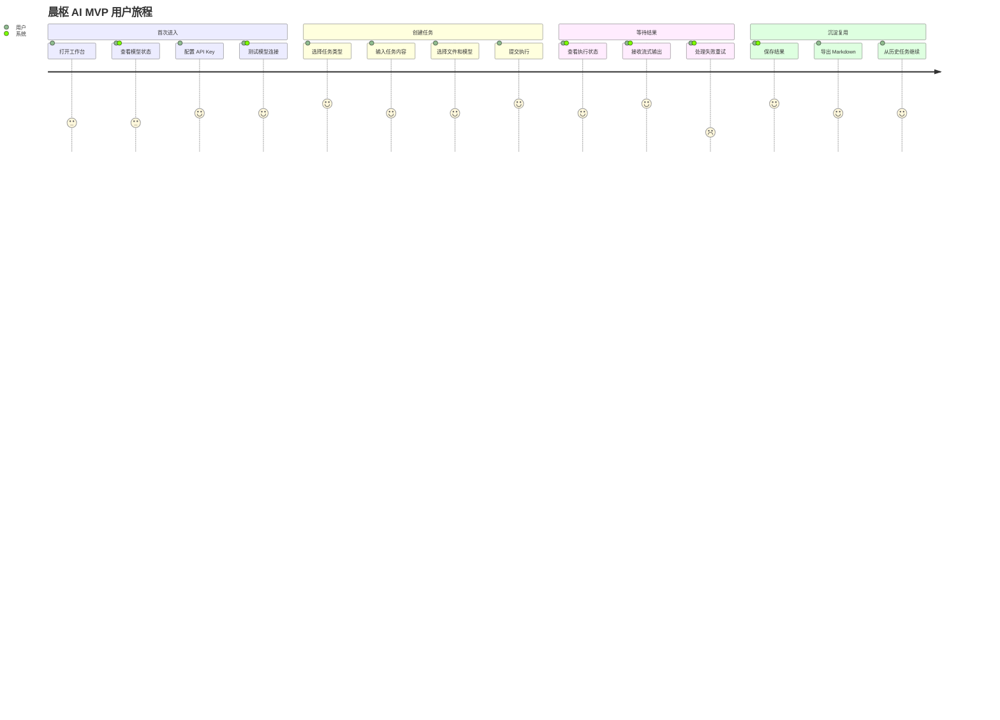

## 5. 全局流程总览

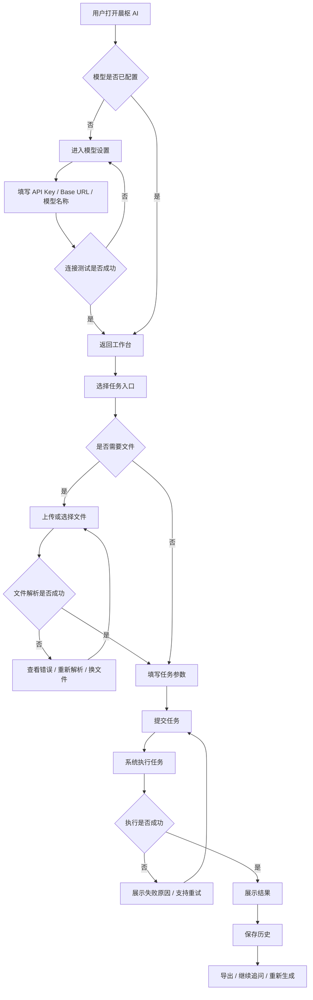

## 6. 首次使用与模型配置流程

### 6.1 流程说明

首次使用时，系统需要先判断是否存在可用模型配置。如果没有配置，用户无法执行 AI 任务，需要先完成模型 API 配置和连接测试。

### 6.2 流程图

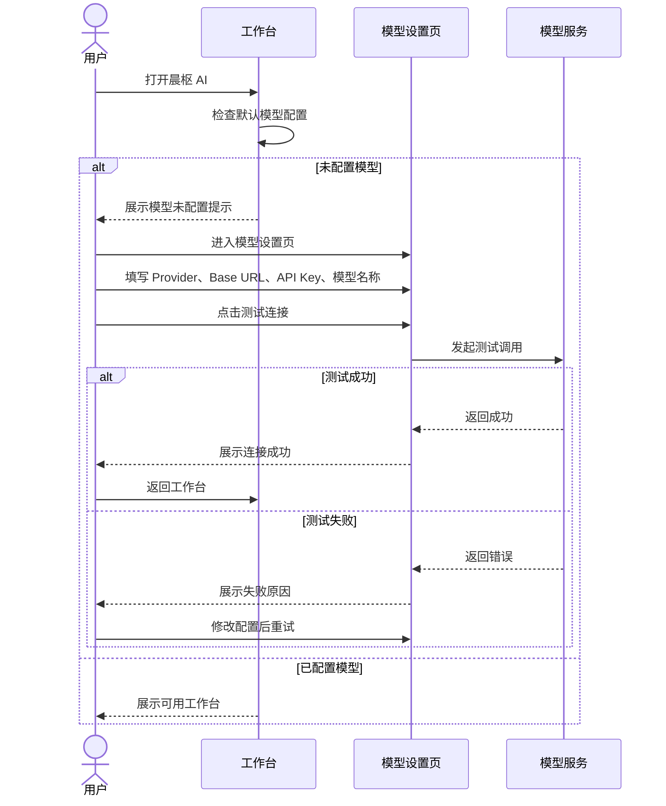

### 6.3 关键规则

- 未配置模型时，任务执行按钮应不可用或执行前拦截。
- API Key 默认隐藏展示。
- 测试失败时需要展示可理解的错误信息。
- 至少支持 OpenAI 兼容接口。

## 7. 通用任务创建与执行流程

### 7.1 流程说明

通用任务流程是所有业务任务的基础。简历面试、内容创作、信息搜集和 arXiv 日报都可以复用“创建任务、执行任务、保存结果”的底层流程。

### 7.2 流程图

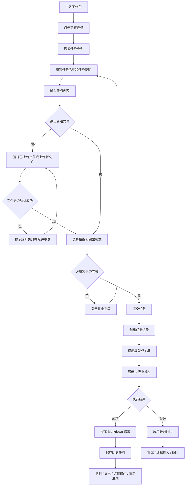

### 7.3 任务状态流转图

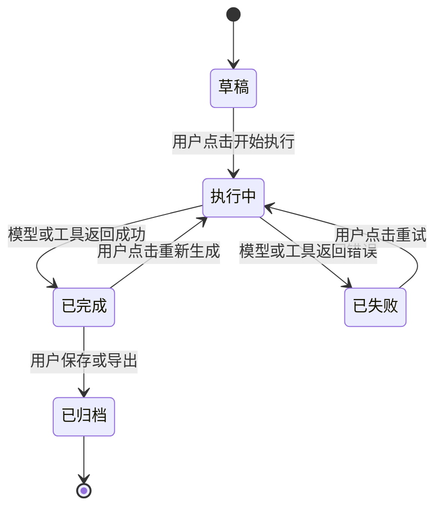

## 8. 文件上传与引用流程

### 8.1 流程说明

文件流程服务于简历分析、论文写作、专利写作、内容创作和知识沉淀。MVP 阶段重点支持上传、解析、预览和任务引用。

### 8.2 流程图

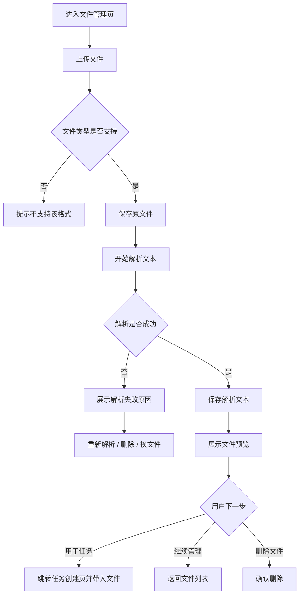

### 8.3 文件状态流转

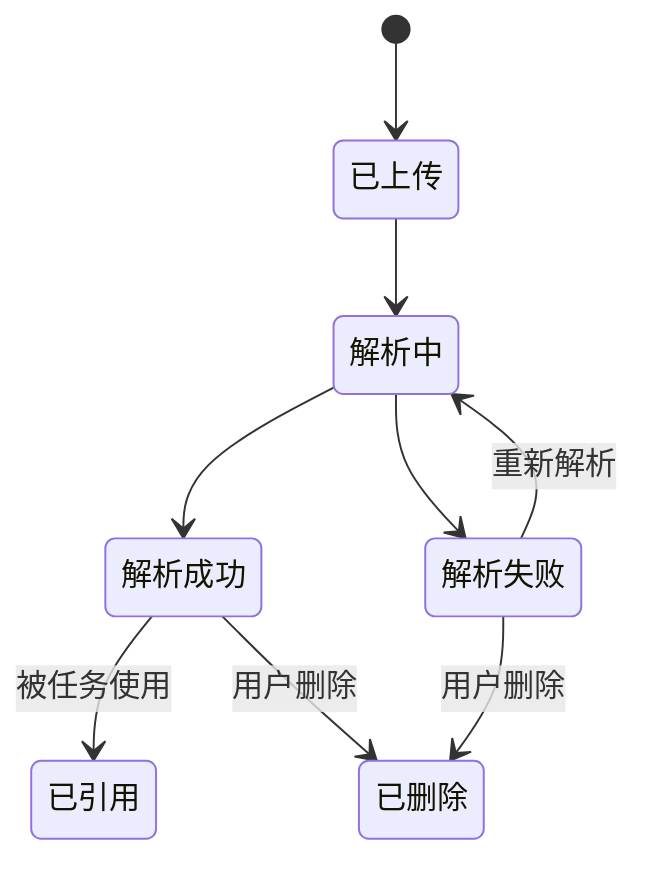

## 9. 简历分析与模拟面试流程

### 9.1 流程说明

简历面试流程是 MVP 的强场景闭环。用户上传简历和岗位 JD，系统先完成分析，再生成面试题，最后根据用户回答形成复盘报告。

### 9.2 用户流程图

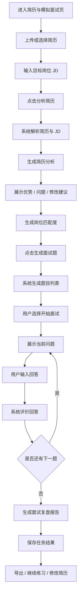

### 9.3 泳道图

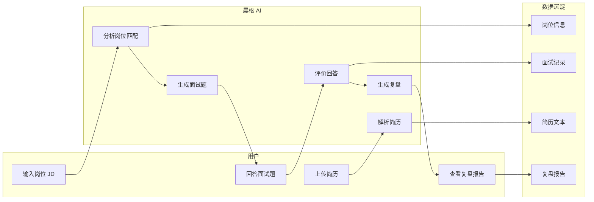

### 9.4 输出要求

- 简历结构分析。
- 经历亮点。
- 简历问题。
- 修改建议。
- 岗位匹配度。
- 面试题列表。
- 单题回答评价。
- 总体复盘报告。

## 10. 内容创作流程

### 10.1 流程说明

内容创作流程支持论文、专利、小说、剧本、歌词、小红书、知乎和公众号。推荐采用“先大纲、后正文、再改写”的流程，降低一次生成结果失控的概率。

### 10.2 流程图

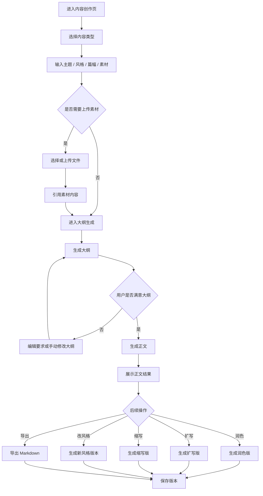

### 10.3 不同内容类型差异

| 内容类型 | 关键输入 | 关键输出 |
| --- | --- | --- |
| 论文草稿 | 研究主题、资料、结构要求 | 摘要、大纲、章节草稿 |
| 专利草稿 | 技术方案、创新点、应用场景 | 交底书、权利要求初稿 |
| 小说 | 题材、人物、世界观、风格 | 大纲、章节、人物设定 |
| 剧本 | 题材、角色、场景、冲突 | 分场、对白、剧情节奏 |
| 歌词 | 主题、情绪、风格、押韵 | 主歌、副歌、桥段 |
| 小红书 | 主题、受众、口吻、标签 | 标题、正文、标签 |
| 知乎 | 问题、观点、论据、风格 | 回答结构、正文 |
| 公众号 | 选题、读者、篇幅、结构 | 标题、大纲、长文 |

## 11. 信息搜集与汇总流程

### 11.1 流程说明

信息搜集流程支持 URL 和关键词两种入口。系统需要保留来源，区分原始事实和模型总结。

### 11.2 流程图

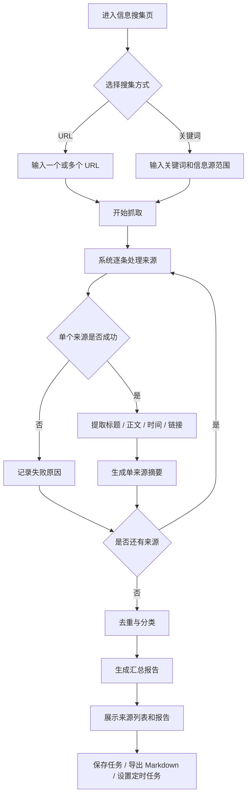

### 11.3 报告生成规则

- 必须展示来源链接。
- 需要区分事实摘要和模型分析。
- 抓取失败的来源应显示失败原因。
- 多来源内容需要去重和归类。
- 输出默认使用 Markdown。

## 12. arXiv 论文日报流程

### 12.1 流程说明

arXiv 日报流程用于追踪指定研究方向的最新论文。MVP 阶段可以先支持手动拉取和手动生成日报，后续再接入定时任务。

### 12.2 手动生成流程图

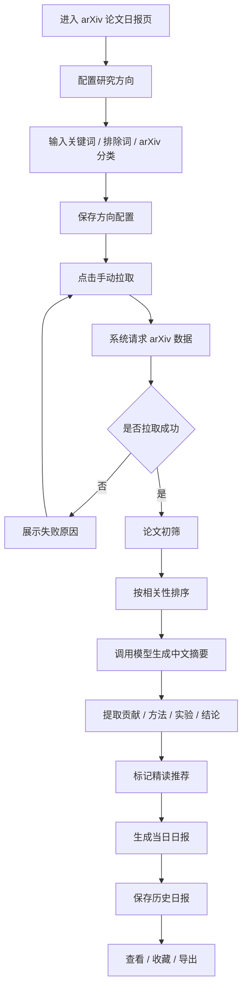

### 12.3 后续定时流程图

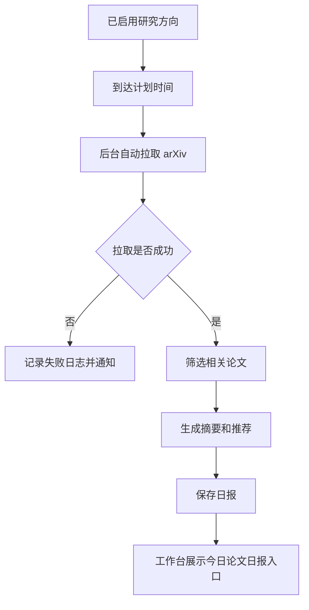

### 12.4 输出要求

- 今日论文概览。
- 推荐精读列表。
- 单篇论文标题。
- 作者。
- 发布时间。
- arXiv 链接。
- 原始摘要。
- 中文摘要。
- 贡献点。
- 方法概述。
- 推荐理由。

## 13. 历史任务查看与导出流程

### 13.1 流程说明

历史任务流程用于保证 AI 产出可追踪、可复用、可导出。它是晨枢 AI 区别于一次性聊天工具的重要流程。

### 13.2 流程图

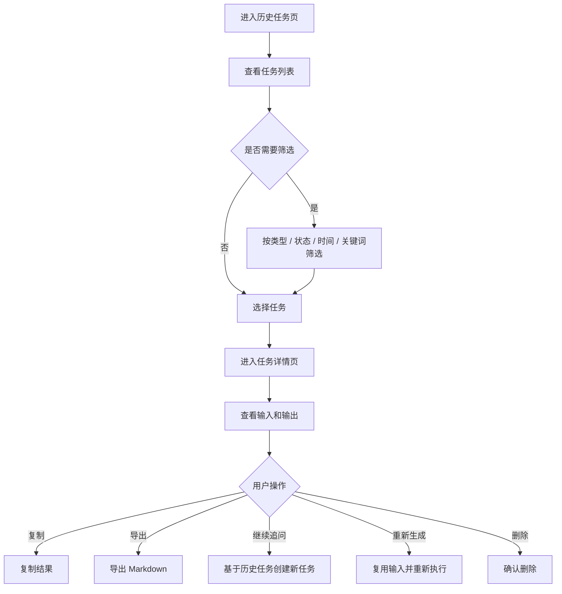

## 14. 异常与失败处理流程

### 14.1 流程说明

MVP 阶段必须处理常见失败场景，避免用户不知道下一步该做什么。

### 14.2 失败处理流程图

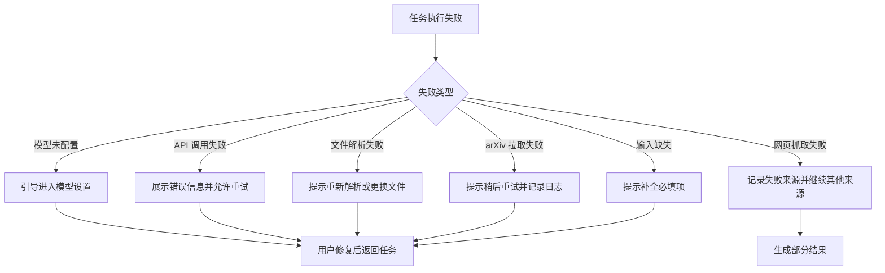

### 14.3 常见异常清单

| 异常类型 | 用户可见提示 | 推荐操作 |
| --- | --- | --- |
| 模型未配置 | 当前没有可用模型 | 前往模型设置 |
| API Key 错误 | 模型连接失败 | 检查 API Key 和 Base URL |
| 文件格式不支持 | 暂不支持该文件类型 | 更换 Markdown、TXT、PDF、DOCX |
| 文件解析失败 | 文件解析失败 | 重新解析或更换文件 |
| 网页抓取失败 | 该来源抓取失败 | 查看失败原因或跳过 |
| arXiv 请求失败 | 论文拉取失败 | 稍后重试 |
| 输入为空 | 请补全必填内容 | 返回表单补充输入 |

## 15. MVP 端到端闭环

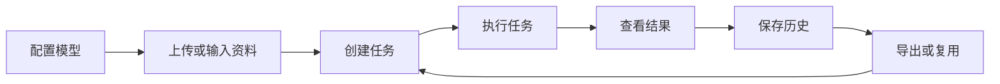

## 16. 流程验收标准

本流程文档对应的 MVP 验收标准如下：

1. 用户首次进入系统时，可以明确知道是否需要配置模型。
2. 用户可以从工作台进入所有 P0 任务流程。
3. 用户可以完成通用任务创建、执行、保存和导出。
4. 用户可以完成文件上传、解析和任务引用。
5. 用户可以完成简历分析、模拟面试和复盘。
6. 用户可以完成内容大纲、正文生成和改写。
7. 用户可以完成 URL 或关键词信息汇总。
8. 用户可以完成 arXiv 方向配置和日报生成。
9. 用户可以从历史任务继续追问或重新生成。
10. 常见失败场景有明确提示和下一步操作。

## 17. 后续衔接

本流程文档完成后，下一步建议进入《技术架构设计文档》。

技术架构文档需要根据本文流程进一步明确：

- 前端页面与路由结构。
- 后端服务模块。
- 任务执行引擎。
- 模型调用服务。
- 文件解析服务。
- 网页抓取服务。
- arXiv 拉取服务。
- 数据库存储结构。
- 异步任务和日志机制。
