# 晨枢 AI - 产品类 - 页面原型说明

## 清单

### 7 个步骤

- [x] 立项与产品定位
- [x] 需求分析
- [ ] 原型与交互设计
- [x] 技术架构设计
- [x] 开发与工程化
- [x] 测试与上线准备
- [ ] 迭代与产品化

### 12 份文档

- [x] 项目立项文档
- [x] 产品定位与范围说明
- [x] PRD 产品需求文档
- [x] MVP 功能清单与优先级
- [x] 页面原型说明
- [x] 用户流程图 / 任务流程图
- [x] 技术架构设计文档
- [x] 数据库设计文档
- [x] API 接口设计文档
- [x] 开发规范文档
- [x] 部署运行文档
- [x] 测试用例与上线检查清单

---

## 1. 文档目的

本文档用于说明晨枢 AI MVP 阶段的页面原型、页面结构、核心区域、主要组件、交互状态和页面跳转关系。

本文档不追求高保真视觉设计，而是先明确产品的信息架构和页面骨架，方便后续进入 UI 设计、前端开发和接口设计。

## 2. 原型范围

MVP 阶段页面范围包括：

- 工作台首页。
- 任务创建页。
- 任务详情页。
- 文件管理页。
- 模型设置页。
- 简历与模拟面试页。
- 内容创作页。
- 信息搜集与汇总页。
- arXiv 论文日报页。
- 历史任务页。

首版暂不包含：

- 多用户管理页。
- 付费订阅页。
- 团队空间页。
- 模型微调页。
- 完整本地模型管理页。
- 股票研究独立高阶看板。

## 3. 设计原则

1. 任务优先。
   页面组织以“创建任务、执行任务、查看结果、复用结果”为核心，而不是以聊天窗口为唯一入口。

2. 信息密度适中。
   晨枢 AI 是工作台产品，页面应偏清晰、克制、可扫描，避免营销页式大面积装饰。

3. 左侧导航稳定。
   MVP 建议采用左侧主导航 + 顶部状态栏 + 中央内容区的布局，降低多模块切换成本。

4. 结果可追踪。
   每个页面都要让用户知道当前任务状态、输入来源、模型配置和输出结果。

5. 先可用，后精致。
   首版原型以流程闭环为主，视觉风格可以在后续 UI 设计阶段深化。

## 4. 全局信息架构图

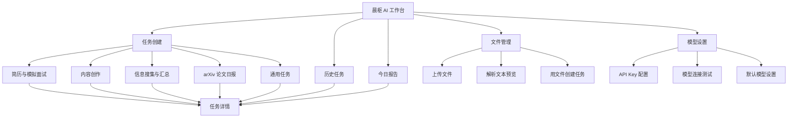

## 5. 全局布局原型

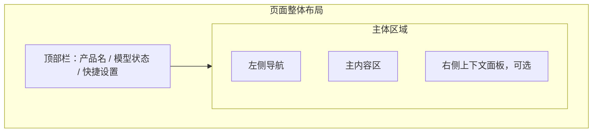

### 5.1 顶部栏

包含内容：

- 产品名称：晨枢 AI。
- 当前模型状态：已连接、未配置、连接失败。
- 当前默认模型。
- 快捷入口：模型设置、文件管理。

### 5.2 左侧导航

建议导航项：

- 工作台。
- 新建任务。
- 简历面试。
- 内容创作。
- 信息搜集。
- arXiv 日报。
- 文件管理。
- 历史任务。
- 模型设置。

### 5.3 主内容区

承载当前页面的主要交互，例如任务表单、任务详情、报告列表和配置表单。

### 5.4 右侧上下文面板

首版可选。适合展示：

- 当前任务关联文件。
- 当前模型配置。
- Prompt 模板摘要。
- 任务执行日志。
- 相关历史任务。

## 6. 页面跳转关系图

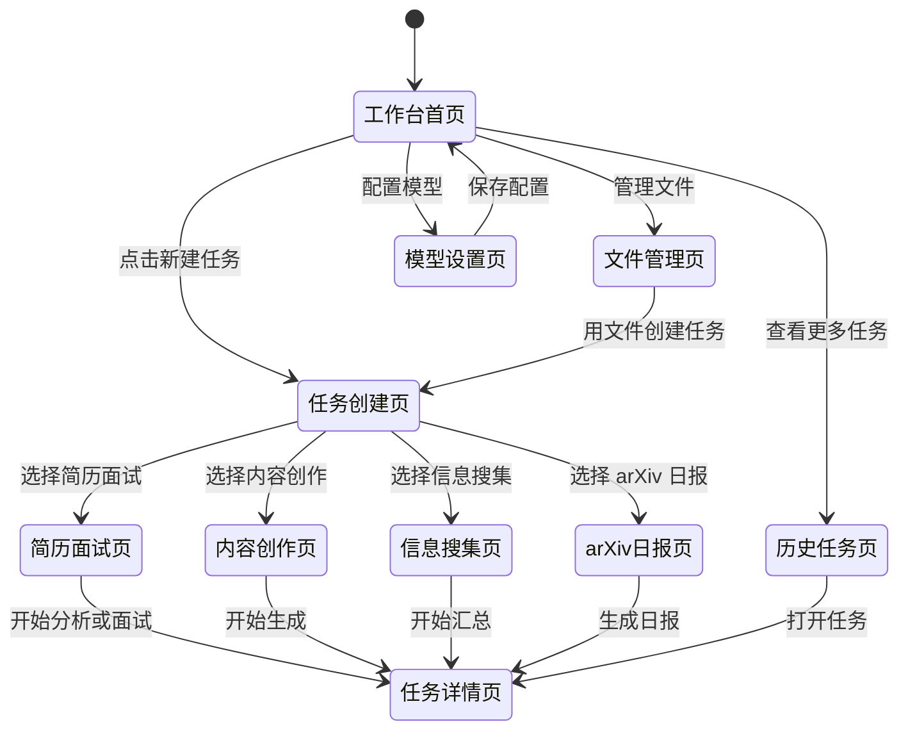

## 7. 工作台首页原型

### 7.1 页面目标

让用户进入系统后快速知道：

- 当前模型是否可用。
- 最近有什么任务。
- 今天有没有自动报告。
- 可以从哪里开始核心任务。

### 7.2 页面线框

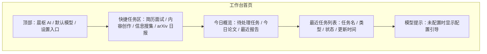

### 7.3 主要组件

- 快捷任务卡片。
- 最近任务表格。
- 模型连接状态标签。
- 今日报告入口。
- 空状态提示。

### 7.4 关键交互

- 点击快捷任务卡片进入对应任务页。
- 点击最近任务进入任务详情页。
- 模型未配置时，点击提示进入模型设置页。

### 7.5 状态说明

- 正常状态：展示快捷入口和最近任务。
- 空状态：没有任务时展示新建任务引导。
- 异常状态：模型未配置或连接失败时展示明确提示。

## 8. 任务创建页原型

### 8.1 页面目标

让用户用统一入口创建不同类型的 AI 任务。

### 8.2 页面线框

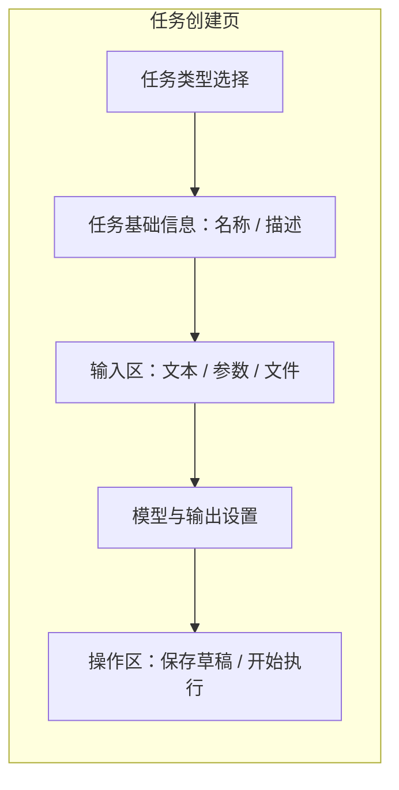

### 8.3 主要组件

- 任务类型选择器。
- 任务名称输入框。
- 多行文本输入框。
- 文件选择器。
- 模型下拉选择。
- 输出格式选择。
- 开始执行按钮。

### 8.4 关键交互

- 选择任务类型后，表单字段随类型变化。
- 选择文件后，展示文件解析状态。
- 点击开始执行后创建任务并跳转任务详情页。

### 8.5 校验规则

- 任务类型必选。
- 任务名称可自动生成，但允许用户修改。
- 核心输入不能为空。
- 模型未配置时不能执行任务。

## 9. 任务详情页原型

### 9.1 页面目标

展示任务执行过程、输入信息、输出结果和后续操作。

### 9.2 页面线框

### 9.3 主要组件

- 任务状态标签。
- 输入摘要折叠面板。
- Markdown 结果渲染区。
- 流式输出区域。
- 操作按钮组。
- 错误提示框。

### 9.4 关键交互

- 执行中实时展示输出。
- 已完成后允许复制、导出、重新生成。
- 失败时允许重试。
- 用户可以基于当前结果继续追问。

### 9.5 状态说明

- 草稿：展示输入，允许继续编辑。
- 执行中：展示进度和流式输出。
- 已完成：展示完整结果和操作按钮。
- 已失败：展示错误原因和重试按钮。

## 10. 文件管理页原型

### 10.1 页面目标

集中管理上传文件，支持查看解析状态，并将文件用于任务。

### 10.2 页面线框

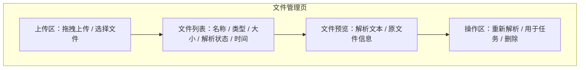

### 10.3 主要组件

- 文件上传组件。
- 文件列表表格。
- 解析状态标签。
- 文本预览面板。
- 文件操作按钮。

### 10.4 支持格式

- Markdown。
- TXT。
- PDF。
- DOCX。

### 10.5 关键交互

- 上传后自动解析。
- 点击文件后右侧或下方展示解析文本。
- 点击“用于任务”进入任务创建页，并自动带入该文件。

## 11. 模型设置页原型

### 11.1 页面目标

让用户配置模型 API，并验证模型是否可用。

### 11.2 页面线框

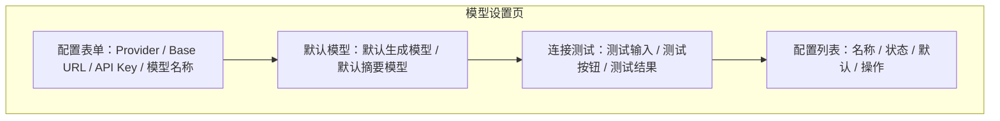

### 11.3 主要组件

- API Provider 输入。
- Base URL 输入。
- API Key 密码输入。
- 模型名称输入。
- 默认模型选择。
- 连接测试按钮。
- 配置列表。

### 11.4 关键交互

- API Key 默认隐藏。
- 点击测试连接后显示成功或失败原因。
- 设置默认模型后，任务创建页默认使用该模型。

## 12. 简历与模拟面试页原型

### 12.1 页面目标

完成简历上传、岗位匹配、面试题生成、回答评价和复盘报告。

### 12.2 页面线框

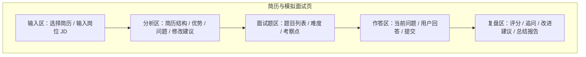

### 12.3 页面分区

- 左侧：简历和岗位输入。
- 中央：分析结果与面试题。
- 右侧：当前作答、评价和复盘摘要。

### 12.4 关键交互

- 上传或选择简历后，点击“分析简历”。
- 输入岗位 JD 后，生成岗位匹配度。
- 点击“生成面试题”后展示问题列表。
- 用户逐题输入回答。
- 系统对每题给出评价，最后生成复盘报告。

### 12.5 输出结构

- 简历优势。
- 简历问题。
- 修改建议。
- 岗位匹配度。
- 面试题列表。
- 单题评价。
- 总体复盘。

## 13. 内容创作页原型

### 13.1 页面目标

支持多种内容类型的创作、改写和导出。

### 13.2 页面线框

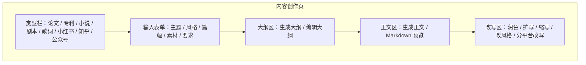

### 13.3 主要组件

- 内容类型标签。
- 主题输入框。
- 风格选择器。
- 篇幅选择器。
- 素材输入区。
- 大纲编辑区。
- 正文编辑区。
- 改写按钮组。

### 13.4 关键交互

- 切换内容类型后，表单提示和输出结构变化。
- 用户可以先生成大纲，再生成正文。
- 用户可以在正文基础上继续改写。
- 支持复制和导出 Markdown。

### 13.5 首版内容类型

- 论文草稿。
- 专利草稿。
- 小说。
- 剧本。
- 歌词。
- 小红书文案。
- 知乎回答。
- 公众号推文。

## 14. 信息搜集与汇总页原型

### 14.1 页面目标

支持 URL 或关键词输入，完成信息抓取、摘要、来源保留和汇总报告。

### 14.2 页面线框

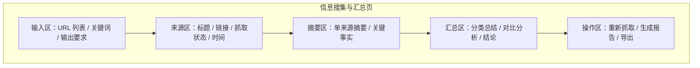

### 14.3 关键交互

- 用户可以一次输入多个 URL。
- 系统逐个展示抓取状态。
- 抓取成功后生成单来源摘要。
- 多来源处理完成后生成总报告。

### 14.4 状态说明

- 待抓取。
- 抓取中。
- 抓取成功。
- 抓取失败。
- 已汇总。

## 15. arXiv 论文日报页原型

### 15.1 页面目标

支持研究方向配置、论文拉取、论文摘要和日报查看。

### 15.2 页面线框

### 15.3 主要组件

- 方向配置表单。
- 关键词输入。
- arXiv 分类选择。
- 论文列表。
- 论文详情抽屉或面板。
- 历史日报列表。

### 15.4 关键交互

- 保存方向配置。
- 手动拉取最新论文。
- 点击论文查看摘要和推荐理由。
- 生成当日日报并保存。

### 15.5 输出结构

- 今日概览。
- 推荐精读论文。
- 论文列表。
- 单篇论文摘要。
- 方法与贡献。
- 后续阅读建议。

## 16. 历史任务页原型

### 16.1 页面目标

让用户快速找回历史任务和结果。

### 16.2 页面线框

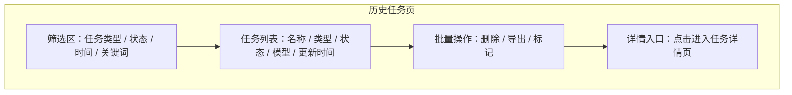

### 16.3 关键交互

- 按类型筛选任务。
- 按关键词搜索任务名称和输出摘要。
- 点击任务进入详情页。
- 支持删除前确认。

## 17. 移动端适配说明

MVP 可以优先桌面端，但页面结构需要为移动端预留适配空间。

移动端建议：

- 左侧导航折叠为底部导航或抽屉菜单。
- 右侧上下文面板下移为折叠区。
- 表格在移动端改为卡片列表。
- 长表单分段展示。
- 操作按钮固定在底部或当前区块下方。

## 18. 关键组件清单

### 18.1 通用组件

- 顶部栏。
- 左侧导航。
- 页面标题区。
- 状态标签。
- 表格。
- 卡片。
- 折叠面板。
- Markdown 预览。
- 空状态。
- 错误提示。
- 确认弹窗。

### 18.2 表单组件

- 单行输入框。
- 多行文本框。
- 下拉选择。
- 标签输入。
- 文件上传。
- 开关。
- 单选按钮。
- 多选框。

### 18.3 AI 任务组件

- 模型选择器。
- Prompt 参数区。
- 流式输出区。
- 结果操作栏。
- 任务状态条。
- 执行日志。

## 19. 页面状态规范

每个核心页面至少考虑以下状态：

- 初始状态。
- 加载状态。
- 空数据状态。
- 正常数据状态。
- 执行中状态。
- 成功状态。
- 失败状态。
- 权限或配置缺失状态。

## 20. MVP 页面验收标准

页面原型完成后，应满足：

1. 用户能从工作台进入所有 P0 模块。
2. 用户能完成创建任务、执行任务、查看结果的闭环。
3. 用户能找到文件管理和模型设置入口。
4. 用户能查看历史任务。
5. 每个任务型页面都有输入区、执行区和结果区。
6. 每个异步任务都有明确状态反馈。
7. 每个失败场景都有错误提示和可执行下一步。

## 21. 后续衔接

本页面原型说明完成后，下一份文档建议继续编写《用户流程图 / 任务流程图》。

该文档需要进一步展开：

- 通用任务创建流程。
- 简历模拟面试流程。
- 内容创作流程。
- 信息搜集流程。
- arXiv 日报流程。
- 文件上传与引用流程。
- 模型配置流程。
